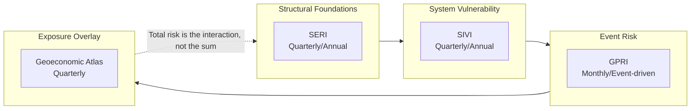
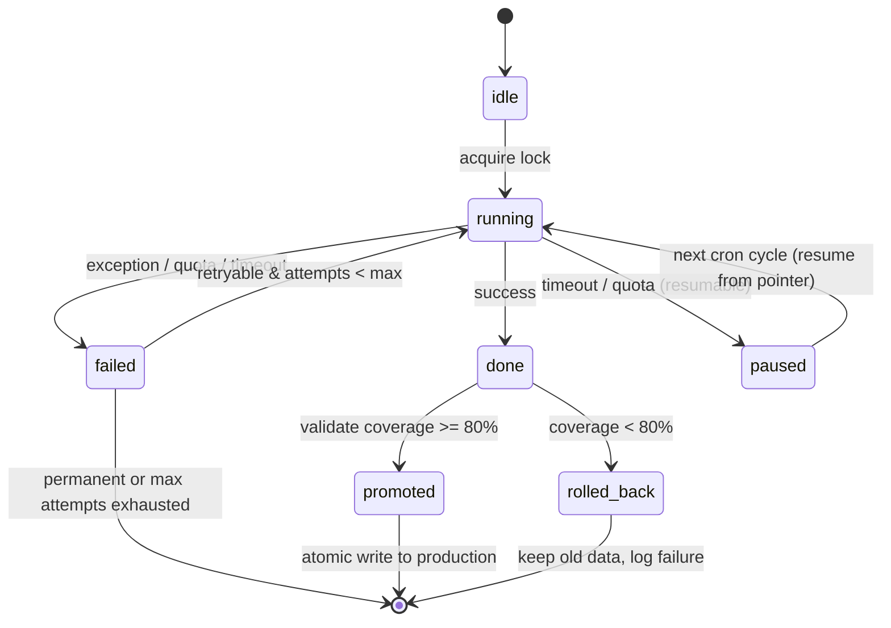

# Blomstra Insights — Architecture Overview
> **Tier:** T1 — Conceptual
> **UDM Version:** UDM-1.0.0
> **BMS Conformance:** BMS-1.1.0
> **Applies to:** SERI, SIVI, GPRI, and all future indices
> **Last updated:** 2026-08-26
> **SSOT For:** Design principles, 4-layer stack, risk model, state machine formalism, file organization
> **Depends on:** None (root T1 document)

---

## 1. Design Principles

1. **Resumable state machines.** Long-running fetches (EIA 5 fuels × N chunks, Comtrade HHI across 200+ countries) are broken into atomic steps. A pointer persists progress so a timeout or quota exhaustion never loses work.
2. **Staging → Atomic Promotion.** No live data is overwritten until a coverage threshold is met. Bad API responses cannot corrupt the production cache.
3. **Graceful degradation.** Missing data is not failure — it is signal. Partial indices are first-class citizens with projected rank ranges.
4. **Research-grade reproducibility.** Same inputs + same code = same outputs. No random seeds, no hidden weights. Statistical validation (Spearman, Cronbach's α, bootstrap sensitivity) is built in.
5. **Clash-proof frontend.** The widget engine never conflicts with other site JavaScript. No global variables, no prototype pollution, no document-level IDs.

---

## 2. The 4-Layer Technical Stack

No layer may skip an adjacent layer, and no layer may depend upward.

```mermaid
flowchart TB
    L4[L4 — FRONTEND<br/>Widget engine (clash-proof, config-driven)<br/>Consumes: REST API JSON]
    L3[L3 — INDEX<br/>Composite builders (SERI, SIVI)<br/>Consumes: Pillar arrays]
    L2[L2 — SHARED UTILITIES<br/>Math, statistics, quality, provenance<br/>Consumes: Raw data arrays]
    L1[L1 — REFERENCE DATA<br/>API fetchers, state machines, caches<br/>Consumes: External APIs]

    L4 --> L3 --> L2 --> L1
```

**Layer invariants:**

| Layer | Invariant | Rationale |
|---|---|---|
| **L1** | Never knows about indices. It only knows "fetch indicator X" or "fetch HHI for year Y." | Prevents tight coupling between data sources and index logic. A new index must not require L1 changes. |
| **L2** | Never knows about WordPress. Operates on pure arrays and scalars. No `get_option()`, no transients. | Makes the statistical layer testable outside WordPress and portable to other platforms. |
| **L3** | Never renders HTML. It produces structured arrays and JSON. | Separation of concerns: L3 handles domain logic; L4 handles presentation. |
| **L4** | Never calls L1 or L2 directly. All data enters via L3 REST endpoints. | Enforces the layer stack. Frontend changes cannot break data fetchers. |

---

## 3. The Three-Layer Risk Model (Domain)

This is a **domain model**, independent of the technical layer cake above.



| Risk Layer | Question | Index | Frequency | Dependency Chain |
|---|---|---|---|---|
| **Structural Foundations** | How capable is the state of absorbing shocks? | **SERI** | Quarterly/Annual | None (base layer) |
| **System Vulnerability** | How exposed are essential infrastructure systems? | **SIVI** | Quarterly/Annual | SERI (contextual overlay) |
| **Event Risk** | Is the neighborhood on fire? | **GPRI** | Monthly/Event-driven | SERI + SIVI (trigger thresholds) |
| **Exposure Overlay** | What weapons are pointed at you? | **Geoeconomic Atlas** | Quarterly | All above (paid tier) |

**Key principle:** Total risk is the **interaction** of layers, not their sum. A country with strong structural foundations (low SERI) but critical system vulnerability (high SIVI) exhibits **asymmetric resilience** — a concept the frontend renders as "stable state, fragile systems."

---

## 4. Detailed Component Diagram

```mermaid
flowchart TB
    subgraph Frontend[Frontend Layer — L4]
        WP[WordPress Page / Shortcode]
        JS[index-frontend-engine.js<br/>Clash-proof, config-driven, multi-instance]
        CSS[index-frontend-styles.css]
    end

    subgraph REST[REST API Layer — L3/L4 Boundary]
        EP1[/wp-json/blomstra/v1/geo-economic-risk-index/]
        EP2[/wp-json/blomstra/v1/sovereign-infrastructure-vulnerability-index/]
        EP3[/wp-json/blomstra/v1/index-history/{slug}/]
    end

    subgraph Index[Index Layer — L3]
        SERI[SERI Backend<br/>Governance / Macro / External / Fiscal]
        SIVI[SIVI Backend<br/>Energy / HHI / Maritime]

        subgraph Core[Core Engine — L3]
            SM[State Machine Coordinator<br/>Locks / Telemetry / Safe Guards]
            PTR[Pointer-based Data Access]
            CB[Composite Builder<br/>Scenario-safe, auto-rollback]
            STAT[Statistical Layer<br/>Spearman, Cronbach α, Bootstrap CI]
            PART[Partial-Rank Projection<br/>OECD/JRC injection points]
        end
    end

    subgraph Util[Shared Utilities — L2]
        UTIL[blomstra-index-utilities.php<br/>Math, percentiles, quality, source tracking]
    end

    subgraph Ref[Reference Data Layer — L1]
        GLOB[global-reference-data.php<br/>State machines, staging→promotion]
        CRON[Cron Handlers with Lock Transients]
        ADMIN[Data Health Dashboard + API Sandbox]
    end

    subgraph APIs[External Data Sources]
        WB[World Bank WDI / WGI]
        IMF[IMF WEO]
        COM[UN Comtrade]
        EIA[EIA]
    end

    Frontend --> REST --> Index --> Util --> Ref --> APIs
```

---

## 5. The State Machine Formalism

Every long-running operation in L1 follows a unified state machine. All implementations (HHI, EIA, WB Indicators) are specializations of this formalism.



**Four invariants:**

1. **Lock invariant:** `running` state implies a lock transient exists. No lock → state is corrupt.
2. **Pointer invariant:** `paused` state implies a pointer exists in `wp_options`. No pointer → state is `idle` or `failed`.
3. **Staging invariant:** `done` state implies staging data exists. If staging is missing, the run was rolled back or never completed.
4. **Promotion invariant:** `promoted` state implies production data was atomically replaced **only after** coverage validation passed. Old production data is discarded only on success.

**See also:**
- T3 Implementation: `03-reference-data-impl.md` §3 — HHI, EIA, and WB pointer specializations
- T3 Implementation: `03-reference-data-impl.md` §4 — Staging→promotion algorithm
- T4 Operational: `07-operations.md` §3 — Stuck-lock recovery procedures

---

## 6. File Organization (Canonical)

```
src/
├── shared/
│   ├── global-reference-data.php      # L1 — v2.7.28
│   └── blomstra-index-utilities.php   # L2 — v1.1.3
├── indices/
│   ├── _template/                     # T3 — Index implementation template
│   │   ├── index-backend.php
│   │   ├── index-shortcode.php
│   │   └── index-admin.php
│   ├── seri/
│   │   ├── seri-backend.php           # BMS-1.1.0 conformant
│   │   └── seri-shortcode.php
│   └── sivi/
│       ├── sivi-backend.php           # BMS-1.1.0 conformant
│       └── sivi-shortcode.php
└── frontend/
    ├── index-frontend-engine.js       # L4 — generic, config-driven
    └── index-frontend-styles.css
```

Every index backend is **self-contained** except for the shared utilities. No cross-index dependencies.

---

## 7. BMS-1.1.0 Conformance Requirements

Every index must implement:

| # | Requirement | Verification | Owner |
|---|---|---|---|
| 1 | Per-pillar storage with `data` + `sources` arrays | `assert(array_key_exists('data', $pillar) && array_key_exists('sources', $pillar))` | L3 |
| 2 | State machine for all async operations | `assert(blomstra_state_{$key} exists && follows T1 formalism)` | L1 |
| 3 | Staging → atomic promotion with coverage ≥ 80% | `assert(staging_count >= expected_count * 0.8)` | L1 |
| 4 | Cron safeguards (lock transients, auto-rollback) | `assert(lock_transient_exists() && auto_rollback_check_passed())` | L1 + L3 |
| 5 | Statistical validation (Spearman, Cronbach α, bootstrap) | `assert(blomstra_cronbach_alpha() !== null && blomstra_bootstrap_ci() !== null)` | L2 |
| 6 | Partial-rank projection for missing pillars | `assert(coverage == 'partial' => projected_range !== null)` | L3 |
| 7 | Admin Dashboard with health status + action suggestions | `assert(wp-admin page renders status table)` | L1 + L4 |
| 8 | REST endpoints with legacy redirects | `assert(endpoint returns T2 shape && legacy 301/302 works)` | L3 |

**See also:** T2 Contract `02-contracts.md` §5 — Formal conformance predicates with data shapes.

---

## 8. Migration History

| Date | Change | From | To |
|---|---|---|---|
| 2026-08 | Reference Data rewrite | Ad-hoc fetchers | State-machine architecture with pointers, staging, atomic promotion |
| 2026-08 | Statistical layer added | None | Spearman, Cronbach's α, bootstrap CI, benchmark correlation |
| 2026-08 | Partial-rank projection | None | OECD/JRC-style injection-point projection for missing pillars |
| 2026-08 | Admin UI overhaul | Basic refresh buttons | Data Health Dashboard + API Diagnostic Sandbox |
| 2026-08 | SERI architecture migration | GERI v3.x | SERI v4.2.1 (BMS-1.0.0) |
| 2026-08 | SIVI architecture migration | CII v1.0.0 | SIVI v2.0.0 (BMS-1.0.0) |
| 2026-08 | Naming standardization | GERI / CII / CIVI | SERI / SIVI / GPRI |
| 2026-08 | BMS standard introduced | Ad-hoc per-index | BMS-1.0.0 unified architecture |
| 2026-08-26 | UDM established | Scattered 9-document corpus | Unified Documentation Model v1.0.0 |
