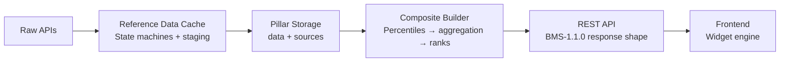
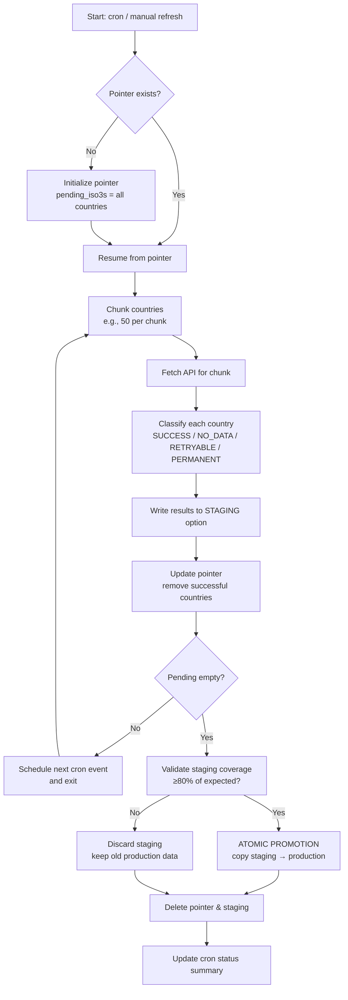
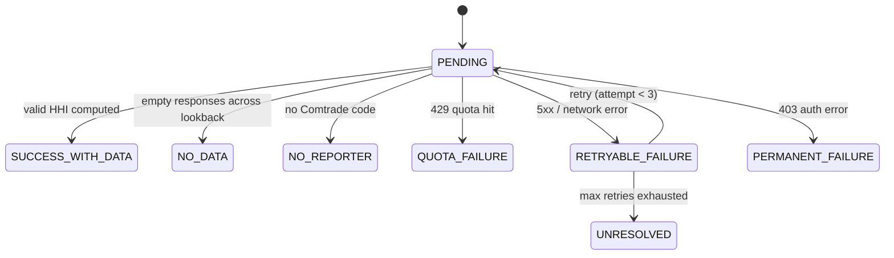

# Reference Data Layer — Implementation Guide
> **Tier:** T3 — Implementation
> **UDM Version:** UDM-1.0.0
> **BMS Conformance:** BMS-1.1.0
> **Applies to:** `src/shared/global-reference-data.php` (v2.7.28)
> **Last updated:** 2026-08-26
> **SSOT For:** Fetcher algorithms, state machine implementations, staging→promotion code, cron handlers
> **Depends on:** `01-architecture.md` (T1 state machine, layer invariants), `02-contracts.md` (T2 error classification, C1 data shape)

---

## 1. Module Overview

`global-reference-data.php` is L1. It fetches, normalizes, and caches data from external APIs. It knows nothing about SERI, SIVI, or any index. It only knows indicators, fuels, and reporter codes.

**Key design pattern:** Every long-running fetcher is a **resumable state machine** that writes to **staging**, validates coverage, and **atomically promotes** to production.

---

## 2. The Five-Stage Pipeline



L1 owns stages A→B. It produces the "Pillar Storage" cache that L3 consumes.

---

## 3. State Machine Implementations

### 3.1 The Pointer Pattern

A pointer is a resumable checkpoint stored in `wp_options`. It defeats PHP's shared-host timeout (30–90s).

**Formal structure:**
```php
array(
    'scope'      => string,       // what is being fetched
    'pending'    => array(),      // work remaining
    'completed'  => array(),      // work finished (optional, idempotency)
    'attempts'   => array(),      // retry counters
    'started_at' => 'ISO8601',
    'metadata'   => array(),      // specialization-specific
)
```

### 3.2 HHI Pointer Specialization

```php
array(
    'target_year'    => 2024,
    'pending_iso3s'  => array('ZWE', 'ZMB', 'UGA', ...),
    'attempts'       => array('ZWE' => 1, 'ZMB' => 0),
    'started_at'     => '2026-08-26 09:00:00',
)
```

**Lifecycle:**
1. `blomstra_refresh_comtrade_hhi_data()` is called.
2. If pointer is empty or `target_year` differs → reset pointer with full country list.
3. Chunk `pending_iso3s` into groups of `BLOMSTRA_HHI_CHUNK_SIZE` (50).
4. For each chunk, fetch via `blomstra_comtrade_fetch_partner_imports_batch()`.
5. Process results, classify each country into a terminal state (§3.5).
6. Remove successfully processed countries from `pending_iso3s`.
7. Update pointer with remaining countries.
8. If `pending_iso3s` is empty → delete pointer (complete).

**Resume behavior:** If the cron job times out at chunk 3 of 10, the next cron run reads the pointer and resumes from chunk 3.

### 3.3 EIA Pointer Specialization

```php
array(
    'fuel_index'   => 2,        // 0=Coal, 1=Gas, 2=Petroleum, 3=Nuclear, 4=Renewables
    'activity'     => 'consumption',  // 'consumption' or 'production'
    'started_at'   => '2026-08-26 09:00:00',
    'failed_fuels' => array(
        '4415' => array('permanent' => false, 'retries' => 1),
    ),
)
```

**Lifecycle:**
1. `blomstra_cron_handle_eia()` reads the pointer.
2. If `fuel_index >= total_fuels` → all done, delete pointer.
3. Process current fuel + activity via `blomstra_process_eia_activity()`.
4. If `advance_pointer === true` (≥80% chunk success, no permanent failures):
   - Toggle activity (consumption → production).
   - If activity was production → increment `fuel_index`, reset to consumption.
5. Update pointer.
6. Schedule next single event if not complete.

**Conditional updates:** Only the current activity (consumption OR production) is updated in staging. The other activity's data is preserved from production.

### 3.4 WB Indicators Pointer Specialization

```php
array(
    'next_index'   => 7,   // which of 13 indicators to process next
    'started_at'   => '2026-08-26 09:00:00',
)
```

**Lifecycle:**
1. Process 3 indicators per cron run (`$batch_size = 3`).
2. Update `next_index` after each indicator.
3. If `next_index >= total_indicators` → delete pointer (complete).
4. Schedule next single event if not complete.

---

## 4. Staging → Atomic Promotion

### 4.1 The Problem

Directly writing fetched data to the production cache is dangerous:
- A partial API response could overwrite good data with empty/null values.
- A network error mid-run could leave the cache in an inconsistent state.
- Quota exhaustion could prevent completion, but already-fetched data would be lost.

### 4.2 The Solution



**Why 80%?** Below 80%, the missing data is likely systemic (API outage, auth failure) rather than sporadic (individual country gaps). The threshold prevents a half-empty dataset from corrupting the live index.

**Why atomic?** WordPress `update_option()` is not atomic across two keys, but the sequence "copy staging → production, then delete staging" is **recoverable**. If the process dies between copy and delete, the next run detects stale staging and re-validates.

### 4.3 HHI Promotion

```php
$staging_data = get_option($staging_key, array());
if (!empty($staging_data) && is_array($staging_data)) {
    $staging_count = count($staging_data);
    $min_expected = max(1, (int) ($total_fetchable * 0.8));
    if ($staging_count >= $min_expected) {
        update_option($production_key, $staging_data, false);
        error_log('HHI: Atomic promotion succeeded...');
    } else {
        error_log('HHI: Staging validation failed...');
    }
}
delete_option($staging_key);
```

**Threshold:** 80% of expected fetchable countries (countries with reporter codes).

### 4.4 EIA Promotion

```php
$fuel_consumption_count = isset($staging_data['consumption'][$product_id])
    ? count($staging_data['consumption'][$product_id]) : 0;
$fuel_production_count = isset($staging_data['production'][$product_id])
    ? count($staging_data['production'][$product_id]) : 0;
$fuel_coverage = $fuel_consumption_count + $fuel_production_count;
if ($fuel_coverage >= $fuel_expected * 0.8 || $total_fuels == 1) {
    update_option($result['production_key'], $staging_data, false);
}
```

**Threshold:** 80% of expected countries for the current fuel, OR only 1 fuel total (development mode).

### 4.5 IMF / WB Indicator Promotion

Uses a **staging transient** pattern:

```php
$staging_key = $cache_key . '_tmp';
set_transient($staging_key, $out, BLOMSTRA_WB_INDICATOR_CACHE_TTL);
set_transient($cache_key, $out, BLOMSTRA_WB_INDICATOR_CACHE_TTL);
delete_transient($staging_key);
```

On the next fetch, if the main transient is expired but the staging transient exists, the staging data is promoted immediately (serves as a warm cache).

---

## 5. Per-Country State Machine (HHI)

The HHI engine tracks **9 distinct terminal states** per country:



| State | Meaning | Action |
|---|---|---|
| `SUCCESS_WITH_DATA` | HHI computed successfully | Write to results, remove from pending |
| `NO_DATA` | Empty responses across all lookback years | Write null result, remove from pending |
| `NO_REPORTER` | ISO3 not in Comtrade reporter map | Write null result, skip immediately |
| `QUOTA_FAILURE` | Rate limit / quota hit during chunk | Skip all remaining countries this run |
| `PERMANENT_FAILURE` | HTTP 403 or auth error | Write null result, remove from pending |
| `RETRYABLE_FAILURE` | Network/HTTP 5xx error, retries remain | Keep in pending, increment attempt counter |
| `UNRESOLVED` | Max retries exhausted without success | Write null result, remove from pending |
| `PENDING` | Still in queue (should not appear at end) | Keep in pointer for next run |
| *(empty)* | Never processed | Remains in pending list |

The `blomstra_hhi_refresh_summary` option stores aggregate counts for all states.

---

## 6. Fetcher Implementations

### 6.1 Country Lists

#### `blomstra_get_global_country_list($force = false)`

Fetches World Bank member countries via paginated API.

**Endpoint:** `https://api.worldbank.org/v2/country?format=json&per_page=300&page={$page}`

**Algorithm:**
1. Check transient cache (`blomstra_global_country_list`).
2. If miss or `$force=true`, paginate through all pages until `page > total_pages`.
3. Skip entries where `region.id === 'NA'` (aggregates).
4. **Page-reached verification (RD-04):** Only cache if all pages were successfully fetched.
5. If partial fetch, return data but do NOT cache; log warning.

**Safeguards:**
- Null `$total_pages` bug fixed (RD-04).
- Only caches if `$reached_end === true`.
- Falls back to stale cache on any failure.

#### `blomstra_get_comtrade_reporter_map($force = false)`

Fetches UN Comtrade reporter code → ISO3 mapping.

**Endpoint:** `https://comtradeapi.un.org/files/v1/app/reference/Reporters.json`

**Algorithm:**
1. Check transient cache (`blomstra_comtrade_reporters`).
2. If miss, fetch and parse `results[]` array.
3. Skip entries where `isGroup === true`.
4. **Skip expired entries entirely (RD-16):** if `entryExpiredDate` is set, skip — do not store, do not overwrite.
5. Store first valid entry per ISO3.

**Safeguards:**
- Expired entries are skipped (not stored, not used for dedup).
- Falls back to stale cache on any failure.
- Debug info stored in `blomstra_comtrade_reporters_debug` option.

### 6.2 Maritime (LSCI)

#### `blomstra_get_maritime_raw($force = false, $attempt = 1)`

Fetches Liner Shipping Connectivity Index from World Bank.

**Endpoint:** `https://api.worldbank.org/v2/country/all/indicator/IS.SHP.GCNW.XQ?format=json&date={start}:{end}&per_page=30000`

**Algorithm:**
1. Check transient cache (`blomstra_maritime_raw`).
2. If miss, fetch 20-year range.
3. **Retry on empty responses (FIX):** If parsed data is empty but attempts remain, retry with backoff.
4. For each row, keep the **latest year** per country.
5. Cache if data is non-empty.

**Returns:**
```php
array('USA' => array('value' => 85.2, 'year' => 2024), ...)
```

**Landlocked handling:** `blomstra_get_maritime_value($iso3)` checks `blomstra_is_landlocked()`. If true, returns `value=0.0, is_landlocked=true`.

### 6.3 HHI Engine (UN Comtrade)

#### `blomstra_comtrade_fetch_partner_imports_batch($reporter_codes, $year, $attempt = 1)`

Fetches import partner data for a batch of reporter codes.

**Endpoint:** `https://comtradeapi.un.org/data/v1/get/C/A/{$year}/0/{$reporters}?partnerCode=0,1,2,3,4,5,6,7,8,9&flowCode=M&cmdCode=total&motCode=0&partner2Code=0&customsCode=C00&includeDesc=True&subscription-key={key}`

**Algorithm:**
1. Validate `COMTRADE_PRIMARY_KEY` is defined and non-empty.
2. Build API URL with all reporter codes comma-separated.
3. **Smart pagination:**
   - Fetch page 1.
   - Track which reporters have `partnerCode === 0` (world total).
   - If not all reporters have world total, fetch page 2, 3, ... up to 20 pages.
   - Stop early if all reporters have world total.
4. Inner retry loop (max 3 attempts) with exponential backoff.
5. Handle 429 with body parsing: extract "Try again in N seconds", wait N+2s.
6. Handle 403 as permanent failure.
7. Handle 5xx as retryable.
8. **Oversized response protection:** reject bodies > 15MB.

**Returns:**
- `array` — trade rows on success
- `BLOMSTRA_COMTRADE_QUOTA_EXHAUSTED` — on 429 quota hit
- `BLOMSTRA_COMTRADE_PERMANENT_FAILURE` — on 403 auth error
- `null` — on network or unrecoverable HTTP error

#### `blomstra_compute_hhi_from_batch_rows($rows, $reporter_codes, $year)`

Computes HHI from raw Comtrade rows.

**Algorithm:**
1. Group rows by `reporterCode`.
2. For each reporter, extract:
   - `world_total` = `primaryValue` where `partnerCode === 0`
   - `partner_values` = `primaryValue` where `partnerCode !== reporterCode` and `value > 0`
3. Compute HHI: `sum((partner_value / world_total)²) × 10000`
4. Clamp to `[0, 10000]`.
5. Round to 2 decimal places.

**Requirements for valid HHI:**
- `world_total` must exist and be `> 0`.
- At least one partner value must exist.

#### `blomstra_refresh_comtrade_hhi_data($year = null, $iso3_list = null, $force = false)`

Main HHI refresh function — the state machine orchestrator.

**Algorithm:**
1. Read pointer via `blomstra_get_hhi_pointer()`.
2. If empty or year mismatch → initialize new pointer with all fetchable countries.
3. Chunk `pending_iso3s` into groups of `BLOMSTRA_HHI_CHUNK_SIZE` (50).
4. For each chunk:
   a. Map ISO3s to reporter codes.
   b. Countries without reporter codes → `NO_REPORTER` state.
   c. For remaining, try target year, then look back up to 4 years.
   d. Classify each country into terminal state (§5).
   e. Write checkpoint to staging option.
   f. Update pointer with remaining pending countries.
   g. Sleep 500ms between chunks (rate limit politeness).
5. If quota hit → abort, preserve pointer for resume.
6. If complete → delete pointer, validate staging, promote to production.

### 6.4 EIA Engine

#### `blomstra_eia_fetch_activity_batch($country_codes, $activity_id, $product_id, $attempt = 1)`

Fetches EIA energy data for a batch of countries.

**Endpoint:** `https://api.eia.gov/v2/international-energy-data/data/`

**Returns:**
```php
array(
    'status' => 'ok' | 'empty' | 'retryable_failure' | 'permanent_failure' | 'quota_exhausted',
    'rows'   => array(...),
    'error'  => null | string,
)
```

**Algorithm:**
1. Validate `EIA_API_KEY` is defined.
2. Build URL with `facets[countryRegionId][]` for each country.
3. Inner retry loop (max `BLOMSTRA_EIA_MAX_ATTEMPTS` = 3).
4. Classify response per T2 error taxonomy (see `02-contracts.md` §6).

#### `blomstra_process_eia_activity($fuel_index, $activity, $iso3_list, &$failed_fuels)`

Main EIA processing function — processes one fuel × one activity.

**Returns:**
```php
array(
    'status'          => 'ok' | 'permanent_failure' | 'quota' | 'retryable' | 'error' | 'partial',
    'message'         => 'Processed 5 chunks, 0 failed...',
    'product_id'      => '4415',
    'fuel_name'       => 'Petroleum and other liquids',
    'fetched_count'   => 182,
    'advance_pointer' => true,   // whether to move to next fuel/activity
    'staging_key'     => 'blomstra_eia_raw_data_staging',
    'production_key'  => 'blomstra_eia_raw_data',
)
```

**Algorithm:**
1. Check if fuel is in permanent failure list → skip, advance pointer.
2. Check retry count ≥ 3 → mark permanent, skip, advance pointer.
3. Chunk countries into groups of `BLOMSTRA_EIA_CHUNK_SIZE` (50).
4. For each chunk, fetch via `blomstra_eia_fetch_activity_batch()`.
5. Track chunk outcomes: ok, empty, retryable, permanent, quota.
6. **Conditional update:** Only update the current activity (consumption OR production). Preserve the other activity from existing production data.
7. Write to staging option.
8. **Pointer advancement decision:**
   - `advance_pointer = (successful_chunks / total_chunks) >= 0.8 && permanent_chunks === 0`
   - If true → toggle activity, or increment fuel if activity was production.
   - If false → keep pointer at current fuel/activity for retry.

### 6.5 World Bank Indicators

#### `blomstra_fetch_wb_indicator_batch($code, $source = null, $force = false)`

Fetches a single World Bank indicator for all countries.

**Algorithm:**
1. Check cache transient (`blomstra_wb_indicator_{md5}`).
2. Check staging transient (`..._tmp`) — if exists, promote to production.
3. **WGI path** (`$source = 3`): Fetch with `source=3` parameter, no `mrnev`.
4. **WDI path** (`$source = null`):
   a. Try `mrnev=1` (most recent non-empty value) first.
   b. If empty, fallback to 10-year date range.
5. Parse response: keep latest year per country.
6. Store in staging + production transients.

**Safeguards:**
- Hybrid mrnev → range fallback for WDI.
- Staging transient warm-cache pattern.
- Exponential backoff retry (max 3 attempts).
- Stale cache fallback on total failure.

### 6.6 IMF WEO

#### `blomstra_fetch_imf_indicator_batch($code, $force = false)`

Fetches IMF WEO historical data.

**Algorithm:**
1. Check cache transient.
2. Check staging transient — promote if exists.
3. Fetch from `https://www.imf.org/external/datamapper/api/v1/{code}`.
4. For each country:
   - Prefer latest actual year (`year <= current_year`).
   - If no actual, use earliest forecast year as `forecast_fallback`.
   - If `current_year` data exists, label as `current_year_estimate`.
5. Map IMF country codes to ISO3 via `BLOMSTRA_IMF_TO_ISO3_MAP`.
6. Store in staging + production transients.

#### `blomstra_get_weo_vintage()`

Returns the current WEO vintage string:
- April–September → `"April {year}"`
- October–March → `"October {year-1}"` or `"October {year}"`

---

## 7. Safeguards

### 7.1 Cron Lock Transients

Every cron handler uses a lock transient to prevent duplicate concurrent execution:

| Pillar | Lock Key | TTL |
|---|---|---|
| Countries | `blomstra_countries_async_in_progress` | 10 min |
| Reporters | `blomstra_reporters_async_in_progress` | 10 min |
| Maritime | `blomstra_maritime_weekly_in_progress` | 10 min |
| HHI | `blomstra_hhi_refresh_in_progress` | 30 min |
| EIA | `blomstra_eia_refresh_in_progress` | 30 min |
| WB Indicators | `blomstra_wb_refresh_in_progress` | 30 min |
| IMF | `blomstra_imf_weekly_in_progress` | 10 min |

**Stuck lock recovery:** If a lock is older than its TTL, it is treated as expired and the next run proceeds normally.

### 7.2 Retry with Exponential Backoff

```php
$max_attempts = 3;
$backoff = 2;  // seconds
// Attempt 1: immediate
// Attempt 2: sleep(2)  → 2s
// Attempt 3: sleep(4)  → 4s
```

For rate-limited responses (HTTP 429):
- **Comtrade 429:** Parse "Try again in N seconds" from body, wait N+2s.
- **EIA 429:** Retry with standard backoff.
- **WB/IMF 429:** Sleep(5 * $attempt).

### 7.3 Permanent Failure Detection

See `02-contracts.md` §6 for the unified error taxonomy.

**Permanent failures are never retried.** They are logged, the country/fuel is marked, and processing continues.

### 7.4 Oversized Response Protection

```php
if (strlen($body_raw) > 15 * 1024 * 1024) {
    blomstra_log_comtrade_call($chunk_label, $year, 'oversized_response', 'response body > 15MB');
    return null;
}
```

Prevents memory exhaustion from unexpectedly large API responses.

### 7.5 Stale Cache Fallback

If all fetch attempts fail, the system falls back to the last cached data:

```php
function blomstra_stale_cache_fallback($cache_key) {
    $stale = get_transient($cache_key);
    return is_array($stale) ? $stale : array();
}
```

This ensures the index never goes completely blank due to a temporary API outage.

### 7.6 Lookback Windows

When data for the target year is unavailable, the system looks back up to `BLOMSTRA_HHI_LOOKBACK` (4) years:

```php
$offset = 0;
while ($offset <= BLOMSTRA_HHI_LOOKBACK && !empty($chunk_codes)) {
    $try_year = $target_year - $offset;
    $rows = blomstra_comtrade_fetch_partner_imports_batch($chunk_codes, $try_year);
    // ... process ...
    $offset++;
}
```

This maximizes data coverage without requiring manual year selection.

---

## 8. Cron Handlers

| Handler | Lock | Hook | Action |
|---|---|---|---|
| `blomstra_cron_handle_hhi()` | 30 min | `blomstra_cron_hhi_weekly_event` | Check lock → call `blomstra_refresh_comtrade_hhi_data()` → update status → clear lock |
| `blomstra_cron_handle_eia()` | 30 min | `blomstra_cron_eia_weekly_event` | Check lock → read pointer → process fuel/activity → atomic promotion → advance pointer → clear lock |
| `blomstra_cron_handle_wb_indicators()` | 30 min | `blomstra_cron_wb_indicators_weekly_event` | Check lock → process up to 3 indicators → update pointer → clear lock |
| `blomstra_cron_handle_imf()` | 10 min | `blomstra_cron_imf_weekly_event` | Check lock → fetch all 6 indicators → update status → clear lock |
| `blomstra_cron_handle_maritime()` | 10 min | `blomstra_cron_maritime_weekly_event` | Check lock → fetch LSCI → validate coverage ≥70% → update status → clear lock |

**Duplicate detection:** If lock exists and is within TTL, the handler logs "Already running – skipping duplicate" and exits immediately.

---

## 9. Snapshot History DB

### 9.1 Schema

```sql
CREATE TABLE wp_blomstra_index_history (
    id BIGINT UNSIGNED NOT NULL AUTO_INCREMENT,
    index_slug VARCHAR(40) NOT NULL,
    iso3 VARCHAR(3) NOT NULL,
    snapshot_period VARCHAR(7) NOT NULL,  -- YYYY-MM
    composite_score DECIMAL(6,2) DEFAULT NULL,
    rank_value SMALLINT UNSIGNED DEFAULT NULL,
    coverage_type VARCHAR(10) DEFAULT NULL,
    pillars_json LONGTEXT DEFAULT NULL,
    recorded_at DATETIME NOT NULL,
    PRIMARY KEY (id),
    UNIQUE KEY idx_slug_iso_period (index_slug, iso3, snapshot_period),
    KEY idx_slug_period (index_slug, snapshot_period)
);
```

### 9.2 Functions

- `blomstra_index_history_maybe_install()` — Creates table on `admin_init` if not present.
- `blomstra_index_snapshot_save($index_slug, $countries)` — Saves current composite to DB.
- `blomstra_index_snapshot_get_history($index_slug, $iso3 = null)` — Retrieves historical snapshots.

---

## 10. REST Endpoints

| Endpoint | Method | Permission | Returns |
|---|---|---|---|
| `/wp-json/blomstra/v1/index-history/{slug}` | GET | `is_user_logged_in` | Snapshot history (T2 C3 shape) |
| `/wp-json/blomstra/v1/country-names` | GET | Public (`__return_true`) | Global country list |

---

## 11. Admin Actions

All admin actions are protected by `check_admin_referer()` and `current_user_can('manage_options')`.

### 11.1 Refresh Actions (schedule cron event)

| Action | Hook |
|---|---|
| `blomstra_ref_refresh_countries` | `blomstra_cron_countries_async_event` |
| `blomstra_ref_refresh_reporters` | `blomstra_cron_reporters_async_event` |
| `blomstra_ref_refresh_maritime` | `blomstra_cron_maritime_weekly_event` |
| `blomstra_ref_refresh_hhi` | `blomstra_cron_hhi_weekly_event` |
| `blomstra_ref_refresh_eia` | `blomstra_cron_eia_weekly_event` |
| `blomstra_ref_refresh_wb_indicators` | `blomstra_cron_wb_indicators_weekly_event` |
| `blomstra_ref_refresh_imf` | `blomstra_cron_imf_weekly_event` |

### 11.2 Flush Actions (delete cache)

| Action | Target |
|---|---|
| `blomstra_ref_flush_countries` | Delete transient |
| `blomstra_ref_flush_reporters` | Delete transient + debug option |
| `blomstra_ref_flush_maritime` | Delete transient + debug option |
| `blomstra_ref_flush_hhi` | Delete option + summary + logs + pointer |
| `blomstra_ref_flush_eia` | Delete option + summary + logs + pointer |
| `blomstra_ref_flush_wb_indicators` | Flush all WB transients + pointer |
| `blomstra_ref_flush_imf` | Flush all IMF transients |
| `blomstra_ref_flush` | **Emergency Flush All** — purges everything |

### 11.3 Landlocked Management

- `blomstra_reset_landlocked` → Reset to default list from constant.
- `blomstra_landlocked_confirm_date` → Update verification date to today.
