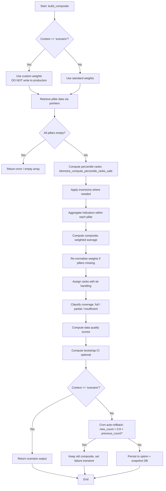

# Index Backend — Implementation Guide
> **Tier:** T3 — Implementation
> **UDM Version:** UDM-1.0.0
> **BMS Conformance:** BMS-1.1.0
> **Applies to:** SERI, SIVI, GPRI, and all future indices
> **Last updated:** 2026-08-26
> **SSOT For:** Composite builder algorithm, pillar definitions, partial-index logic, scenario safety, cron auto-rollback, REST API registration
> **Depends on:** `01-architecture.md` (T1 risk model), `02-contracts.md` (T2 C2 pillar shape, C3 REST shape, conformance predicates), `04-utilities-impl.md` (T2 statistical functions)

---

## 1. Backend Responsibilities

Each index backend is a **self-contained** PHP module with zero cross-index dependencies. It handles:

1. **Pillar data retrieval** — reads from L1 reference data cache via `get_option()` / `get_transient()`.
2. **Percentile normalization** — converts raw values to 0–100 vulnerability percentiles via L2 utilities.
3. **Pillar aggregation** — weighted average of present indicators within each pillar.
4. **Composite ranking** — assigns ranks, handles ties.
5. **Partial index logic** — projected rank ranges for missing-pillar countries.
6. **Scenario-safe sensitivity testing** — weight perturbation without overwriting live data.
7. **REST API registration** — exposes `/wp-json/blomstra/v1/{slug}`.
8. **Snapshot persistence** — saves to `wp_blomstra_index_history` MySQL table.
9. **Cron safeguards** — auto-rollback if build produces <80% of previous country count.

---

## 2. Pillar Definitions

### 2.1 SERI Pillar Definitions

| Pillar | Weight | Indicators | Source | Inversion |
|---|---|---|---|---|
| Governance | 25% | RQ, RL, CC, PV, GE, VA (average) | WB WGI (source=3) | Yes |
| Macro | 25% | GNI growth, inflation, unemployment, GDP volatility, inflation volatility | WB WDI | No |
| External | 25% | Reserves, external debt, current account | WB WDI | Reserves & CA inverted |
| Fiscal | 25% | Gov debt, gov balance, debt trajectory (CAGR) | IMF WEO (primary), WB WDI (fallback) | Gov balance inverted |

**Minimum required:** 3 of 4 pillars.

### 2.2 SIVI Pillar Definitions

| Pillar | Weight | Indicators | Source | Inversion |
|---|---|---|---|---|
| Energy | 33.33% | Multi-fuel consumption-weighted dependency | EIA | No |
| HHI | 33.33% | Import partner concentration index | UN Comtrade | No |
| Maritime | 33.34% | Liner Shipping Connectivity Index | WB WDI | Yes |

**Minimum required:** 2 of 3 pillars.

### 2.3 Pillar Definition Template

Every new index must define pillars using this exact structure:

```php
const INDEX_PILLARS = array(
    'pillar_key' => array(
        'weight'       => 33.33,           // sum of all weights = 100
        'min_required' => 2,               // minimum pillars for partial coverage
        'indicators'   => array(
            'indicator_key' => array(
                'source'    => 'WB_WDI',   // from L1 controlled vocabulary
                'code'      => 'NY.GDP.MKTP.KD.ZG',
                'inversion' => false,      // true = high raw -> low vulnerability
                'fallback'  => null,       // or array('source' => ..., 'code' => ...)
            ),
        ),
    ),
);
```

---

## 3. Composite Builder Algorithm

### 3.1 Entry Point

```php
function {slug}_build_composite(
    bool $force = false,
    string $context = 'manual',        // 'manual' | 'cron' | 'scenario'
    ?array $custom_weights = null,     // per-indicator overrides
    ?array $custom_composite_weights = null  // per-pillar overrides
): array;
```

**Scenario safety:** If `$custom_weights !== null` or `$custom_composite_weights !== null`, the function **must** return the computed array **without** calling `update_option()`.

### 3.2 Canonical Build Algorithm



**Step-by-step:**

1. **Retrieve raw pillar data** from L1 cache (via `get_option` / `get_transient`).
2. If empty and not scenario → return error array.
3. If empty and scenario → return empty array (no crash).
4. For each indicator:
   a. `blomstra_compute_percentile_ranks_safe($raw_values, $winsor_pct)`
   b. Apply inversion if needed: `$pct = 100 - $pct`
5. Aggregate indicators within each pillar (simple average or weighted).
6. Aggregate pillars to composite:
   a. `Sum(pillar_score * pillar_weight) / Sum(pillar_weight_of_present)`
   b. Re-normalize weights if pillars missing.
7. Assign ranks (descending score = ascending rank; ties = average rank).
8. Classify coverage:
   - `full` = all pillars present
   - `partial` = min_required met but not all present
   - `insufficient` = below min_required → exclude
9. Compute data quality scores (`blomstra_pillar_quality_score`).
10. Compute weight-sensitivity interval (`blomstra_bootstrap_ci`) — optional.
11. Compute projected rank ranges for partial countries (`blomstra_project_partial_rank_composite`).
12. If NOT scenario:
    a. Cron auto-rollback check: `new_count < 0.8 * previous_count`?
    b. If rollback triggered → preserve old data, set transient, return old data.
    c. Else → `update_option(production_key, $output, false)`.
    d. Save snapshot via `blomstra_index_snapshot_save()`.
13. Return `$output`.

### 3.3 Inversion Rules

| Index | Pillar | Inversion Logic |
|---|---|---|
| SERI | Governance | High WGI (good governance) → low vulnerability: `$pct = 100 - $pct` |
| SERI | External — Reserves | High reserves → low vulnerability: `$pct = 100 - $pct` |
| SERI | External — Current Account | Surplus → low vulnerability: `$pct = 100 - $pct` |
| SERI | Fiscal — Gov Balance | Surplus → low vulnerability: `$pct = 100 - $pct` |
| SIVI | Maritime | High connectivity → low vulnerability: `$pct = 100 - $pct` |

---

## 4. Partial-Index Logic

### 4.1 Coverage Classification

```php
if ($pillars_present < MIN_PILLARS_REQUIRED) {
    $excluded[$iso3] = 'Insufficient pillar coverage';
    continue;
}
```

- **SERI:** min 3 of 4 pillars
- **SIVI:** min 2 of 3 pillars

Partial countries (min_required met but not all pillars) receive:
- `coverage_type = 'partial'`
- `is_definitive = false`
- `rank_display.string_format = 'N/A*'`
- `projected_rank_range` via `blomstra_project_partial_rank_composite()`

### 4.2 Projected Rank Range (Injection Points)

```php
$injection_points = array(0 => 0, 10 => 10, 50 => 50, 90 => 90, 100 => 100);
$projected = blomstra_project_partial_rank_composite(
    $known_pillars,   // ['energy' => 65, 'maritime' => 40]
    'hhi',            // missing pillar
    $injection_points,
    $weights          // ['energy' => 33.33, 'hhi' => 33.33, 'maritime' => 33.34]
);
// Returns: [0 => 35.0, 10 => 38.3, 50 => 51.7, 90 => 65.0, 100 => 68.3]
```

**Frontend display:** The projected range is shown as "Rank could be between X and Y depending on missing pillar data."

---

## 5. Scenario-Safe Sensitivity

### 5.1 Weight Perturbation

The backend accepts custom weights and computes a new composite without touching production:

```php
$scenario = sivi_build_composite(
    false, 'scenario', null,
    array('energy' => 40, 'hhi' => 30, 'maritime' => 30)
);
// Live production data remains untouched
```

### 5.2 Sensitivity Interval

Built-in via `blomstra_bootstrap_ci()`:

```php
$ci = blomstra_bootstrap_ci(
    $pillar_values_by_country,
    $pillar_weights,
    1000,   // n resamples
    0.95    // CI level
);
// Returns: iso3 => array('point' => 42.35, 'ci_low' => 38.12, 'ci_high' => 46.78)
```

**Methodological note:** This is a **weight-sensitivity interval**, NOT a classical confidence interval. It tests robustness to ±10% perturbations in pillar weights.

---

## 6. Cron Auto-Rollback

### 6.1 Safeguard

```php
$previous_count = count($previous_data);
$new_count      = count($output['countries']);

if ($new_count < $previous_count * 0.8) {
    set_transient('{slug}_auto_build_failed', array(
        'timestamp' => current_time('mysql'),
        'reason'    => 'Build produced fewer than 80% of previous countries',
        'previous'  => $previous_count,
        'new'       => $new_count,
    ), HOUR_IN_SECONDS);
    return $previous_data;  // Keep old data
}
```

### 6.2 Checkpointing

For long-running index-specific operations, backends write checkpoints mid-run:

```php
$sivi_hhi_checkpoint = function() use (&$results, &$summary, &$sources) {
    $existing = get_option(SIVI_HHI_KEY, array());
    $merged_data = array_merge($existing['data'] ?? array(), $results);
    $merged_sources = array_merge($existing['sources'] ?? array(), $sources);
    update_option(SIVI_HHI_KEY, array(
        'data'    => $merged_data,
        'sources' => $merged_sources
    ), false);
};
```

If PHP times out mid-run, the next execution resumes from the checkpoint.

---

## 7. REST API Registration

### 7.1 Endpoint Registration

```php
add_action('rest_api_init', function () {
    register_rest_route('blomstra/v1', '/{slug}/', array(
        'methods'  => 'GET',
        'callback' => '{slug}_rest_callback',
        'permission_callback' => '__return_true', // or 'is_user_logged_in'
    ));
});
```

### 7.2 Legacy Redirects

If renaming an index, preserve old endpoints:

```php
// SERI legacy
register_rest_route('blomstra/v1', '/geo-economic-risk-index/', array(
    'methods'  => 'GET',
    'callback' => function() {
        wp_redirect(rest_url('blomstra/v1/seri/'), 301);
        exit;
    },
));

// SIVI legacy
register_rest_route('blomstra/v1', '/critical-infrastructure-index/', array(
    'methods'  => 'GET',
    'callback' => function() {
        wp_redirect(rest_url('blomstra/v1/sivi/'), 301);
        exit;
    },
));
```

### 7.3 Response Shape

Must conform to T2 contract `02-contracts.md` §4 (C3 — L3 → L4 Contract).

---

## 8. Implementation Template

### 8.1 File: `index-backend.php`

```php
<?php
/**
 * {INDEX_NAME} Backend — BMS-1.1.0 Conformant
 * File: src/indices/{slug}/{slug}-backend.php
 */

// Prevent direct access
if (!defined('ABSPATH')) exit;

// ─── Constants ───
define('{SLUG}_OPTION_KEY', 'blomstra_{slug}_composite_index');
define('{SLUG}_VERSION', '1.0.0');
define('{SLUG}_MIN_PILLARS', 2); // or 3 for SERI

// ─── Pillar Definitions ───
const {SLUG}_PILLARS = array(
    'pillar_key' => array(
        'weight'       => 33.33,
        'min_required' => {SLUG}_MIN_PILLARS,
        'indicators'   => array(
            'indicator_key' => array(
                'source'    => 'WB_WDI',
                'code'      => 'NY.GDP.MKTP.KD.ZG',
                'inversion' => false,
                'fallback'  => null,
            ),
        ),
    ),
);

// ─── Build Function ───
function {slug}_build_composite(
    bool $force = false,
    string $context = 'manual',
    ?array $custom_weights = null,
    ?array $custom_composite_weights = null
): array {
    $is_scenario = ($custom_weights !== null || $custom_composite_weights !== null);

    // 1. Retrieve pillar data from L1
    $pillars = array();
    foreach ({SLUG}_PILLARS as $pillar_key => $pillar_def) {
        $raw = get_option("blomstra_{$pillar_key}_data", array());
        if (!empty($raw['data'])) {
            $pillars[$pillar_key] = $raw;
        }
    }

    if (empty($pillars) && !$is_scenario) {
        return array('error' => 'No pillar data available');
    }

    // 2. Compute percentiles, apply inversions, aggregate...
    // [Full algorithm from §3.2]

    $output = array(
        'version'         => {SLUG}_VERSION,
        'last_updated'    => current_time('mysql'),
        'total_countries' => count($countries),
        'excluded_countries' => count($excluded),
        'weights'         => $weights,
        'countries'       => $countries,
    );

    // 3. Cron auto-rollback
    if (!$is_scenario && $context !== 'scenario') {
        $previous = get_option({SLUG}_OPTION_KEY, array());
        $prev_count = count($previous['countries'] ?? array());
        $new_count = count($countries);

        if ($new_count < $prev_count * 0.8 && $prev_count > 0) {
            set_transient('{slug}_auto_build_failed', array(
                'timestamp' => current_time('mysql'),
                'reason'    => 'Build produced fewer than 80% of previous countries',
                'previous'  => $prev_count,
                'new'       => $new_count,
            ), HOUR_IN_SECONDS);
            return $previous;
        }

        update_option({SLUG}_OPTION_KEY, $output, false);
        blomstra_index_snapshot_save('{slug}', $countries);
    }

    return $output;
}

// ─── REST API ───
add_action('rest_api_init', function () {
    register_rest_route('blomstra/v1', '/{slug}/', array(
        'methods'  => 'GET',
        'callback' => '{slug}_rest_callback',
        'permission_callback' => '__return_true',
    ));
});

function {slug}_rest_callback() {
    $data = get_option({SLUG}_OPTION_KEY, array());
    if (empty($data)) {
        return new WP_Error('no_data', 'Index data not available', array('status' => 503));
    }
    return rest_ensure_response($data);
}
```

### 8.2 File: `index-shortcode.php`

```php
<?php
/**
 * {INDEX_NAME} Shortcode
 * File: src/indices/{slug}/{slug}-shortcode.php
 */

function {slug}_shortcode($atts) {
    $config = shortcode_atts(array(
        'view'    => 'table',
        'sort'    => 'rank',
        'limit'   => 50,
    ), $atts, '{slug}');

    $json_config = wp_json_encode($config);

    return sprintf(
        '<div data-blomstra-index="{slug}" data-blomstra-config='%s'></div>',
        esc_attr($json_config)
    );
}
add_shortcode('blomstra_{slug}', '{slug}_shortcode');
```

---

## 9. Testing Matrix

| Test | Input | Expected Output | Owner |
|---|---|---|---|
| Full build | All pillars present | `coverage == 'full'`, ranks definitive | L3 |
| Partial build | 1 pillar missing (SIVI) | `coverage == 'partial'`, projected range present | L3 |
| Insufficient build | 2 pillars missing (SIVI) | Country excluded, counted in `excluded_countries` | L3 |
| Scenario build | Custom weights | Correct scores, NO database write | L3 |
| Auto-rollback | New count < 80% old | Old data preserved, failure transient set | L3 |
| Stale L1 cache | L1 data > 7 days old | Build uses stale data, quality flags reflect staleness | L1 + L3 |
| Empty L1 cache | No L1 data | Build returns error array or empty | L3 |
| Bootstrap CI | 1000 resamples | `ci_low` < `point` < `ci_high` for all countries | L2 |
| Cron duplicate | Second cron fires while first running | Second run skipped, "Already running" logged | L1 |
| Legacy redirect | Old endpoint URL | HTTP 301 to canonical endpoint | L3 |
| REST shape | GET /{slug}/ | Valid JSON matching T2 C3 contract | L3 |
