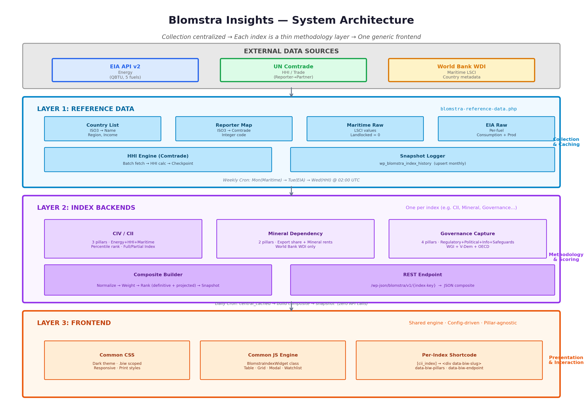

# Architecture

## The core idea, in one sentence

**Collection is centralized; each index is a thin dispatcher over that central data, with its own complete fallback if the central data isn't there.**

---

## Why this shape exists

Early on, every index tool collected its own data directly from external APIs — its own EIA calls, its own Comtrade calls, its own World Bank calls, its own caching, its own pagination. That works for one index. It breaks down with 7–10:

- **Shared rate limits and quotas.** Comtrade and EIA both have real quota ceilings. If multiple indices all hit Comtrade independently for the same underlying trade data, they burn through quota N times over.
- **Duplicated bugs.** A fix discovered in one tool's collection code wouldn't automatically propagate to another tool's separate copy.
- **Duplicated maintenance surface.** Seven copies of "fetch from EIA, paginate, checkpoint, handle rate limits" is seven places a future bug can hide.

So collection was migrated, pillar by pillar, into one shared layer.

---

## The four layers

### Layer 1: Reference Data

**File:** `blomstra-reference-data.php` (WPCode PHP snippet, "Run Everywhere")

Owns:
- Global country list and reference lookups (landlocked list, Comtrade reporter code map)
- Centralized raw collection for each pillar type (Maritime, HHI/Comtrade, EIA/Energy, World Bank indicators, IMF forecasts) — pagination, chunking, per-chunk checkpointing, rate-limit handling
- Multi-year snapshot history table (`wp_blomstra_index_history`), shared by every index
- Admin UI under **Blomstra Insights Tools** menu
- Shared REST routes: `/wp-json/blomstra/v1/country-names` and `/wp-json/blomstra/v1/index-history/{slug}`

**Cron:** Weekly — Mon(Maritime) → Tue(EIA) → Wed(HHI) → Thu(WB) → Fri(IMF) @ 02:00 UTC

Full function-by-function detail: [`08-reference-data-functions.md`](08-reference-data-functions.md).

### Layer 2: Index Backends

**File:** One per index, e.g. `Backend - CII Critical Infra Vulnerability Index.php` (see the naming note in the repo [README](../README.md) — this is CII in code today, CIV is the intended eventual name, not yet renamed)

Each index:
- Calls Reference Data first
- Falls back to its own complete collection logic only if central data is missing
- Owns only what's genuinely index-specific: scoring methodology, REST endpoint, admin page
- Calls `blomstra_index_snapshot_save()` after every successful build

**Cron:** Daily — reads `central_cached` (zero API calls), builds composite, snapshots

### Layer 3: Frontend

**Files:** `blomstra-index-frontend-engine.js` + `blomstra-index-frontend-styles.css` (site-wide)

- One shared `BlomstraIndexWidget` class
- Config-driven via `data-biw-*` attributes on a container div
- Pillar-agnostic: works for 2-pillar, 3-pillar, or 4-pillar indices without code changes — verified directly against the live Geopolitical Risk (3 pillars) and Mineral Export & Rent Dependency (2 pillars) pages, not just a design intention

### Layer 4: Methodology Architecture *(new)*

**Document:** [`10-engineering-research-standards.md`](10-engineering-research-standards.md)

This is the institutional layer that turns implementation discoveries into reusable rules. It exists because CII solved partial coverage, GERI solved forecast separation, and Governance Capture solved multi-source integration — but those solutions lived in code, not in standards. Layer 4 ensures the next index inherits those lessons rather than rediscovering them.

Key contents:
- **BMS-001:** Data Provenance Standard
- **BMS-002:** Missing Data & Partial Coverage Standard (generalized to N pillars)
- **BMS-003:** Normalization Standard
- **BMS-004:** Weighting Standard
- **BMS-005:** Temporal Data Standard
- **BMS-006:** Forecast Separation Standard
- **BMS-007:** Country Universe Standard

Every new index MUST declare conformance to a Layer B standard version. Deviations MUST be documented in `src/indices/{slug}/docs/deviations.md`.

---

## The primary + fallback principle

> An index tool calls the centralized model **first**. Only if that's unavailable, empty, or fails does the index fall back to making its own direct API call.

Concretely, each pillar dispatcher takes a mode:

| Mode | Use Case |
|---|---|
| `central` | "Fetch from Central Data" admin button — forces live refresh via Reference Data |
| `central_cached` | Daily cron — zero API calls, reads stored cache |
| `api` | "Fetch from Direct API" admin button — tests fallback path in isolation |
| `auto` | Normal operation — central first, fallback silently if empty |

---

## Migration status

All three CII pillars have completed migration:

| Pillar | Central Collection | CII's Role |
|---|---|---|
| Maritime | `blomstra_get_maritime_raw()` | Dispatcher + fallback; owns inversion/structural-zero/percentile |
| HHI (Comtrade) | `blomstra_get_comtrade_hhi_data()` | Dispatcher + fallback; full engine lives centrally |
| Energy (EIA) | `blomstra_get_eia_raw_data()` | Raw per-fuel collection centralized; multi-fuel weighting formula stays in CII |

GERI pillars (World Bank + IMF):

| Pillar | Central Collection | GERI's Role |
|---|---|---|
| Governance (WGI) | `blomstra_fetch_wb_indicator_batch()` | Dispatcher; percentile inversion |
| Macro (WDI) | `blomstra_fetch_wb_indicator_batch()` | Dispatcher; volatility computation; GNI→GDP fallback |
| External (WDI) | `blomstra_fetch_wb_indicator_batch()` | Dispatcher; divergence calculation |
| Fiscal (WDI) | `blomstra_fetch_wb_indicator_batch()` | Dispatcher; trajectory computation |
| Forward Pressure (IMF) | `blomstra_fetch_imf_forecast_batch()` | Dispatcher; delta computation; MUST NOT leak into Structural layer |

---

## Case study: the Comtrade reporter-code bug

USA/India/Belgium consistently showed "no data" for HHI. The cause: Comtrade lists **multiple reporter entries sharing one ISO3** for countries with a discontinuity — e.g. USA has both a current entry (code 842) and an expired "USA and Puerto Rico" entry (code 841, expired 1980). The original code used last-one-wins overwrite, and Comtrade lists the expired entry *after* the current one.

**Fix:** an entry with `entryExpiredDate` can never overwrite an already-stored code. This logic lives in `blomstra_get_comtrade_reporter_map()` — any future index touching Comtrade MUST use this shared function.

---

## Build reliability pattern (any future index's automation MUST copy this)

CII's automation isn't just "run a cron job" — it has four independent safety mechanisms worth reusing verbatim in future indices, because each one exists to close a real failure mode that was actually hit:

**1. Self-healing build lock.** A transient (`cii_building_lock`, 5-minute TTL) prevents two builds running concurrently. If a previous run crashed and left the lock set, it isn't permanent — any lock older than the TTL is treated as stale and force-cleared automatically. No manual unlock step exists or is needed.

**2. Freshness gate before every cron build.** Before the daily cron builds anything, it checks whether *every* pillar's most recent `last_updated` timestamp is within `CII_FRESHNESS_PILLAR` (10 days). If any pillar is missing or stale, the entire build is skipped for that day (`status: 'skipped_stale_refdata'`) rather than silently publishing a composite built on stale or absent pillar data. A never-yet-built composite is always treated as fresh (bootstrapping case) so the very first build isn't blocked by having nothing to compare against.

**3. Cron and its manual test share one code path.** `cii_daily_cron_callback()` and an admin "Force Run Daily Cron Now" button both call the exact same `cii_run_daily_build_logic()` — same freshness gate, same build function. This directly closes a real bug class hit in an earlier version, where cron called a *second, independently-written* composite implementation that quietly diverged from the real one (wrong Energy formula, silently dropped landlocked countries, a cruder rank approximation, a REST payload shape that changed every night then changed back on the next manual rebuild). One implementation, called from both places, makes that entire bug class structurally impossible rather than something to remember to keep in sync.

**4. Two deliberately separate health signals.** `cii_cron_status` is updated by *both* the real cron and the manual test button — it answers "did the last logical run succeed." `cii_last_wpcron_fired` is stamped *only* by the real `wp-cron` hook, unconditionally, before anything else runs — it answers "is the schedule itself actually alive." This separation exists specifically so clicking the test button can't mask a genuinely broken `wp-cron` schedule (a common, easy-to-miss WordPress failure mode, especially on low-traffic sites where `wp-cron.php` only fires on page visits). An admin notice fires if that second signal goes stale (>30h) or was never set, distinct from — and in addition to — whatever the first signal says. See [`06-deployment.md`](06-deployment.md) for how to fix a genuinely broken `wp-cron` schedule.

Every future index's cron/automation MUST follow this same four-part shape, not just "add a `wp_schedule_event` and hope."

---

## Reference Implementation Mapping

When building a new index, consult this table before inventing a new pattern:

| Problem | Reference Implementation | Standard |
|---------|------------------------|----------|
| Partial pillar coverage / rank uncertainty | CII | BMS-002 |
| Structural zero handling | CII Maritime | BMS-002 |
| Forecast / structural separation | GERI | BMS-006 |
| Data provenance | GERI | BMS-001 |
| Historical trajectory / volatility | GERI | BMS-005 |
| HHI / concentration | CII | — |
| Multi-source integration | Governance Capture | BMS-007 |
| Data refresh safeguards | GERI | — |
| Version / vintage | GERI | BMS-005 |
| Cron safety | CII | — |
| Snapshot history | Reference Data | — |

---

## What to read next

- The full data pipeline, stage by stage → [`02-data-flow.md`](02-data-flow.md)
- Every Reference Data function, precisely → [`08-reference-data-functions.md`](08-reference-data-functions.md)
- Why CII scores the way it does → [`09-methodology-deepdive.md`](09-methodology-deepdive.md)
- The Blomstra-wide research standards → [`10-engineering-research-standards.md`](10-engineering-research-standards.md)
- Building a new index → [`05-index-template.md`](05-index-template.md)
