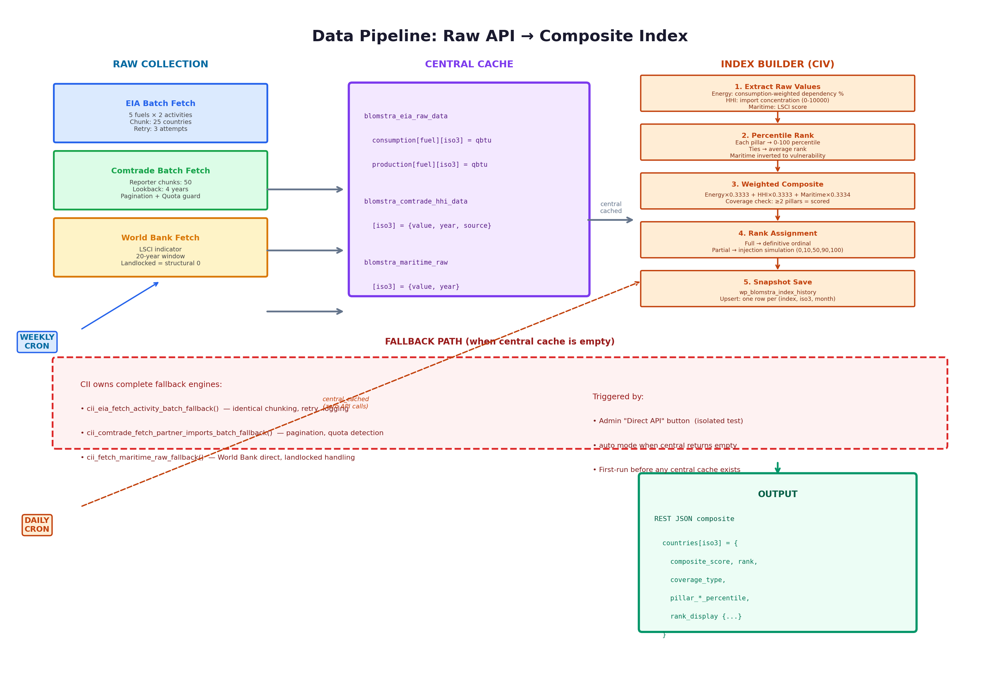

# Data Flow



---

## Overview

Data flows through four stages: **Raw Collection → Central Cache → Index Builder → REST Output**. The weekly cron handles stages 1–2. The daily cron handles stages 3–4. Fallback engines exist in every index backend for first-run or failure scenarios.

---

## Stage 1: Raw Collection (Weekly Cron)

### EIA Energy
- **Source:** EIA API v2 /international/data/
- **Fuels:** 5 product IDs (Coal, Natural Gas, Petroleum, Nuclear, Renewables)
- **Activities:** Production (1) + Consumption (2)
- **Chunk size:** 25 countries per batch
- **Retry:** 3 attempts with exponential backoff
- **Output shape:** `blomstra_eia_raw_data['consumption'][fuel_id][iso3] = qbtu`

### Comtrade HHI
- **Source:** UN Comtrade API v1 /get/C/A/HS
- **Chunk size:** 50 reporter codes per batch
- **Lookback:** 4 years (current year → current year − 4)
- **Pagination:** Up to 20 pages per chunk, stops early when all reporters have `partnerCode=0`
- **Quota guard:** Detects HTTP 429/403, parses retry-after, or marks quota exhausted
- **Output shape:** `blomstra_comtrade_hhi_data[iso3] = {value, year, source}`

### World Bank Maritime
- **Source:** WDI indicator `IS.SHP.GCNW.XQ`
- **Window:** 20 years of data
- **Landlocked:** Structural zero (not missing data)
- **Output shape:** `blomstra_maritime_raw[iso3] = {value, year}`

---

## Stage 2: Central Cache

Reference Data stores raw results as WordPress options (not transients — these are the source of truth):

| Option Key | Data Type | TTL |
|---|---|---|
| `blomstra_eia_raw_data` | `{consumption: {}, production: {}}` | Overwritten on refresh |
| `blomstra_comtrade_hhi_data` | `{iso3: {value, year, source}}` | Overwritten on refresh |
| `blomstra_maritime_raw` | `{iso3: {value, year}}` | Transient, 1 week |

---

## Stage 3: Index Builder (Daily Cron)

### Step 1: Extract Raw Values
Reads the three pillar options. Extracts non-null `value` fields.

### Step 2: Percentile Rank
```php
cii_compute_percentile_ranks($values_by_iso3)
```
- Sorts values ascending
- Assigns average rank for ties
- Converts to 0–100 percentile: `((rank - 0.5) / n) * 100`

### Step 3: Weighted Composite
```php
$composite = ($energy_pct * 0.3333) + ($hhi_pct * 0.3333) + ($maritime_vuln * 0.3334);
```

Maritime connectivity is inverted to vulnerability:
```php
$maritime_vulnerability = 100 - $maritime_connectivity_percentile;
```

### Step 4: Coverage Check
- **Full Index:** ≥ all pillars present (3/3 for CIV)
- **Partial Index:** ≥ `CII_MIN_PILLARS_REQUIRED` (2/3) but < total pillars
- **Excluded:** < 2 pillars. Not scored. No fabricated fill-in.

### Step 5: Rank Assignment
See [diagram](../assets/diagram-03-rank-assignment.png) and [03-api-contract.md](03-api-contract.md) for full `rank_display` schema.

### Step 6: Snapshot Save
```php
blomstra_index_snapshot_save('cii', $countries);
```
Upserts one row per (index_slug, iso3, YYYY-MM) into `wp_blomstra_index_history`.

---

## Stage 4: REST Output

The composite is served as JSON at the index's registered REST endpoint. The frontend fetches this plus `/country-names` and `/index-history/{slug}` in parallel.

---

## Fallback Path

When central cache is empty (first run, or after flush):

1. **Admin test buttons** — "Direct API" triggers the index's own fallback engine in isolation
2. **Auto mode** — silently falls back if central returns empty
3. **Complete parity** — fallback engines use identical chunk sizes, retry logic, and checkpointing as Reference Data

The fallback exists so no single point of failure can take an index down.
