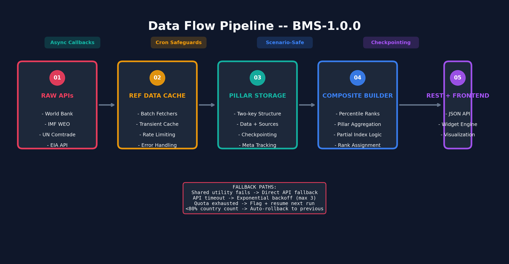

# Data Flow

> **Applies to:** SERI v4.2.1+, SIVI v2.0.0+
> **Standard:** BMS-1.0.0

---

## The Pipeline



Every index follows the same 5-stage pipeline:

```
Raw APIs -> Reference Data Cache -> Pillar Storage -> Composite Builder -> REST API -> Frontend
```

---

## Stage 1: Raw APIs

### SERI Data Sources

| Pillar | Primary Source | Fallback | Indicators |
|---|---|---|---|
| Governance | World Bank WGI (source=3) | Direct WB API | Rule of law, corruption, stability |
| Macro | World Bank WDI | Direct WB API | GNI growth, inflation, unemployment, GDP volatility, inflation volatility |
| External | World Bank WDI | Direct WB API | Reserves, external debt, current account |
| Fiscal | IMF WEO | World Bank WDI (central gov) | Gov debt, gov balance, debt trajectory (CAGR) |

### SIVI Data Sources

| Pillar | Primary Source | Fallback | Indicators |
|---|---|---|---|
| Energy | EIA API (batch) | Direct EIA API | Multi-fuel consumption-weighted dependency |
| HHI | UN Comtrade (batch) | Direct Comtrade API | Import partner concentration (0-10,000) |
| Maritime | World Bank WDI | Direct WB API | Liner shipping connectivity (structural zero for landlocked) |

---

## Stage 2: Reference Data Cache

The shared utilities layer (`blomstra-index-utilities.php`) provides:

- **Batch fetchers** -- `blomstra_fetch_wb_indicator_batch()`, `blomstra_fetch_imf_indicator_batch()`, `blomstra_refresh_eia_raw_data()`, `blomstra_refresh_comtrade_hhi_data()`
- **Caching** -- Transient-based caching with configurable TTL
- **Rate limiting** -- Comtrade quota detection, EIA chunking (25 countries), HHI chunking (50 reporters)
- **Error handling** -- Quota exhaustion flags, retry with exponential backoff, surgical single-reporter fallback

**Dispatch pattern:**
```php
// Index calls shared utility first
$raw = blomstra_refresh_eia_raw_data( $iso3_list );

// If shared utility fails or is not installed, index falls back to its own direct API function
if ( empty( $raw ) ) {
    return sivi_refresh_energy_pillar_fallback( $countries );
}
```

This creates a **two-tier architecture**: shared cache for performance, direct API for resilience.

---

## Stage 3: Pillar Storage

### Storage Shape

```php
// Energy pillar (SIVI)
array(
    'data' => array(
        'USA' => array( 'value' => 12.5, 'year' => 2024, 'source' => 'EIA', 'note' => '...' ),
        'CHN' => array( 'value' => 23.1, 'year' => 2024, 'source' => 'EIA', 'note' => '...' ),
    ),
    'sources' => array(
        'USA' => array(
            'energy_dependency' => array(
                array( 'source' => 'EIA', 'scope' => 'national', 'year' => 2024 ),
            ),
        ),
    ),
)
```

### Checkpointing

For long-running fetches (EIA 5-fuel x N chunks, Comtrade HHI with pagination), the index writes **checkpoints** to the option table mid-run:

```php
$sivi_hhi_checkpoint = function () use ( &$results, &$summary, &$sources ) {
    $existing = get_option( SIVI_HHI_KEY, array() );
    $merged_data = array_merge( $existing['data'] ?? array(), $results );
    $merged_sources = array_merge( $existing['sources'] ?? array(), $sources );
    update_option( SIVI_HHI_KEY, array( 'data' => $merged_data, 'sources' => $merged_sources ), false );
};
```

If PHP times out at minute 4 of a 5-minute Comtrade run, the next run resumes from the checkpoint instead of starting over.

---

## Stage 4: Composite Builder

### Percentile Normalization

Every indicator is converted to a **percentile rank** within the global cross-section:

```php
$energy_pct = blomstra_compute_percentile_ranks_safe( $energy_raw_values, 0.0 );
```

- Higher raw value -> higher percentile -> higher vulnerability (for most indicators)
- Maritime connectivity is **inverted** (high connectivity -> low vulnerability)
- Governance WGI scores are inverted (high WGI = good governance -> low vulnerability)

### Pillar Aggregation

```php
$score_sum = 0;
$weight_sum = 0;
foreach ( $present as $pillar ) {
    $score_sum += $pillar['value'] * $pillar['weight'];
    $weight_sum += $pillar['weight'];
}
$composite = $score_sum / $weight_sum;
```

### Partial Index Logic

```php
if ( $pillars_present < MIN_PILLARS_REQUIRED ) {
    $excluded[ $iso3 ] = 'Insufficient pillar coverage';
    continue;
}
```

- SERI: min 3 of 4 pillars
- SIVI: min 2 of 3 pillars

Partial countries get **projected rank ranges** instead of definitive ranks.

---

## Stage 5: REST API

### SERI Endpoint
```
GET /wp-json/blomstra/v1/geo-economic-risk-index
```
Legacy: `/wp-json/blomstra/v1/geo-economic-risk-index` (redirects preserved)

### SIVI Endpoint
```
GET /wp-json/blomstra/v1/sovereign-infrastructure-vulnerability-index
```
Legacy: `/wp-json/blomstra/v1/critical-infrastructure-index` (redirects preserved)

### Response Shape

```json
{
  "version": "4.2.1",
  "last_updated": "2026-08-10 08:00:00",
  "total_countries": 182,
  "excluded_countries": 14,
  "weights": { "governance": 25, "macro": 25, "external": 25, "fiscal": 25 },
  "countries": {
    "USA": {
      "iso3": "USA",
      "name": "United States",
      "geri_structural": 42.35,
      "coverage": "full",
      "rank_display": { "best_estimate": 45, "string_format": "#45" },
      "data_quality": { "governance": 3, "macro": 3, "external": 3, "fiscal": 3 },
      "measurement_flags": { "coverage_ratio": 1.0, "is_definitive": true, "missing_pillars": [] },
      "pillars": { "governance": { "score": 38.2, "weight": 25 }, ... }
    }
  }
}
```

---

## Fallback Paths

```
Admin clicks "Fetch (Async)"
    -> wp_schedule_single_event( time(), 'sivi_async_fetch_energy' )
    -> Background task runs sivi_refresh_energy_pillar( null, 'auto' )
    -> Tries blomstra_refresh_eia_raw_data() (shared cache)
    -> If empty / not installed -> sivi_refresh_energy_pillar_fallback() (direct EIA API)
    -> Persists to sivi_energy_data option
    -> Updates sivi_energy_meta with last_fetched

Admin clicks "Build from Cache"
    -> sivi_build_composite( false, 'manual' )
    -> Reads sivi_energy_data, sivi_hhi_data, sivi_maritime_data
    -> Computes percentiles, aggregates, assigns ranks
    -> Persists to sivi_composite_index option
    -> Saves snapshot via blomstra_index_snapshot_save()
```

---

## Error Handling

| Failure | Behavior |
|---|---|
| API timeout | Retry with exponential backoff (max 3 attempts) |
| Comtrade quota exhausted | Flag `quota_dead`, skip remaining chunks, resume on next run |
| EIA rate limit (429) | Wait + retry, then fall back to direct API if shared cache fails |
| Empty response (HTTP 200, zero rows) | Log as `empty`, do not cache nulls as zeros |
| Build produces <80% of previous country count | Keep old composite, set `auto_build_failed` transient |
| Missing country list | Return `array('error' => 'No country list available')` |
