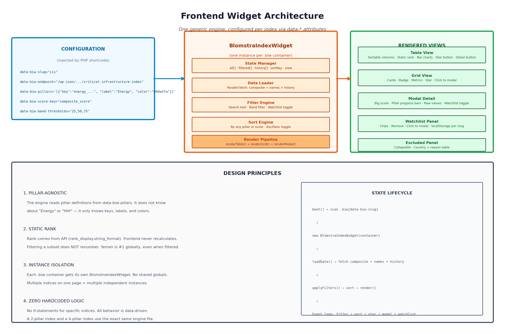

# Frontend Engine



---

## Overview

One shared JavaScript engine (`blomstra-index-frontend-engine.js`) and one shared CSS file (`blomstra-index-frontend-styles.css`) power every Blomstra index widget. The engine is entirely **config-driven** via `data-biw-*` HTML attributes. It knows nothing about specific pillar names, counts, or scoring logic. A single PHP shortcode per index (e.g. `[cii_index]`) outputs one `<div class="biw" data-biw-slug="...">` with the config attributes — no per-index JavaScript or CSS at all.

---

## Boot Process

```javascript
// On DOMContentLoaded (or immediately if already loaded, handling the case
// where a page builder injects the shortcode's HTML after initial page load)
document.querySelectorAll('.biw[data-biw-slug]:not([data-biw-initialized])')
```

Each matched element gets one independent `BlomstraIndexWidget` instance. **All DOM queries inside an instance are scoped to that instance's own container** (`root.querySelector`, never `document.getElementById`) — this is what lets multiple indices, or multiple copies of the same index, coexist on one page without ID collisions or shared state. `data-biw-initialized` is set after boot so a container is never double-initialized (relevant if `window.BlomstraIndexFrontendRescan` is called manually after AJAX-loaded content).

---

## Configuration API (data-* attributes)

### Required

| Attribute | Example | Purpose |
|---|---|---|
| `data-biw-slug` | `"cii"` | Unique ID. Used for the localStorage watchlist key (`biw_watchlist_<slug>`), the default history endpoint path, and as the marker that tells the engine "this is a widget container." Must match the slug used in `blomstra_index_snapshot_save()` or rank-delta silently won't find history |
| `data-biw-endpoint` | `/wp-json/blomstra/v1/critical-infrastructure-index` | REST endpoint for live composite data |
| `data-biw-pillars` | JSON array, see below | Column definitions — drives every dynamic part of the UI |

### Optional, with defaults

| Attribute | Default | Purpose |
|---|---|---|
| `data-biw-names-endpoint` | `/wp-json/blomstra/v1/country-names` | Rarely needs overriding — one shared route serves every index |
| `data-biw-history-endpoint` | `/wp-json/blomstra/v1/index-history/<slug>` | Same — only override if an index's history genuinely needs a different route |
| `data-biw-title` / `data-biw-subtitle` / `data-biw-eyebrow` | `""` / `""` / `"Strategic Intelligence"` | Header text |
| `data-biw-score-key` | `"composite_score"` | Must match the API's composite field name |
| `data-biw-score-label` | `"Composite Score"` | Display label — e.g. CII uses `"Vulnerability Score"` |
| `data-biw-coverage-key` | `"coverage_type"` | Field for the partial/full badge |
| `data-biw-band-thresholds` | `"25,50,75"` | Comma-separated cut points splitting scores into 4 bands — not universal, pick values suited to your index's own score distribution |
| `data-biw-band-labels` | `"Low,Medium,High,Extreme"` | Must have exactly 4 entries, matching the 4 bands the thresholds create |
| `data-biw-band-select-label` | `"All Levels"` | The filter dropdown's "show everything" text — e.g. `"All Vulnerability Levels"` |
| `data-biw-methodology` | `""` | HTML string, rendered as the methodology footer box |

### Pillar Definition Shape

```json
[
  {
    "key": "energy_dependency_percentile",
    "raw_key": "energy_dependency_raw",
    "label": "Energy Dependency",
    "color": "#60a5fa",
    "missingNote": "No data for this pillar"
  }
]
```

| Field | Required | Description |
|---|---|---|
| `key` | Yes | Must match a field name in the API's per-country object |
| `raw_key` | No | If present, shown in the modal's raw-value grid. Omit for a pillar with no meaningful raw unit |
| `label` | Yes | Display label — becomes the column header, sort option, legend badge, modal row label |
| `color` | No (defaults to blue) | Bar-fill color in table/modal — pick something that reads against the dark theme |
| `missingNote` | No | Tooltip text when this pillar's value is null for a given country |

**This one array is the entire mechanism that makes the engine pillar-count-agnostic.** A 2-pillar index and a 4-pillar index both work with zero engine code changes — verified directly against the real Geopolitical Risk (3 pillars) and Mineral Export & Rent Dependency (2 pillars) pages, not just a design intention.

---

## State Object

Each widget instance maintains its own independent state:

```javascript
{
  all: [],           // all countries from API
  filtered: [],      // after search/filter/sort
  names: {},         // ISO3 → name map
  history: {},       // from index-history endpoint
  indexMeta: null,   // full API response
  view: 'table',     // 'table' | 'grid'
  sortKey: 'composite_score',
  sortAsc: false,
  showWatchlistOnly: false
}
```

## Rendering Pipeline

1. **loadData()** — fetches composite + names + history in parallel; if the history fetch fails for any reason, the widget degrades gracefully (shows `NEW` everywhere) rather than breaking
2. **applyFilters()** — search text, band filter, watchlist filter
3. **sort** — by selected key, asc/desc toggle
4. **render()** — calls renderTable() + renderGrid(), toggles visibility
5. **Rank display** — uses `rank_display.string_format` directly from the API

---

## Rank Rendering (Critical Rule)

**Rank is a property of the DATA, not the VIEW.**

The frontend uses `rank_display.string_format` from the API response. It never recalculates rank. When a user filters by region or sorts by a pillar score, the Rank column still shows the country's **actual global rank**.

```javascript
// CORRECT — static from API
renderCell: (row) => `<td>${row.rank_display.string_format}</td>`

// WRONG — never do this
rows.forEach((row, index) => { row.rank = index + 1; })
```

This matters in practice, not just in principle: an earlier, unrelated widget on this system (built before the shared engine existed) computed a `global_rank` field once, client-side, right after the initial data load — which happened to be safe only because it ran *before* any filtering occurred, not because the pattern itself was safe. Any future edit that reordered those two steps would have silently broken it with no error. Reading `rank_display` straight from the API sidesteps that entire failure class — filtering can never touch a value it never computes.

---

## Rank-Delta Arrows

The frontend computes change by comparing the current row against the previous snapshot in `state.history`:

```javascript
// Compare current best_estimate vs previous period's best_estimate
// positive delta = moved toward #1 (improved)
// Shows ↑3, ↓1, —, or NEW
```

Computed from `rank_display.best_estimate` specifically (not the raw `rank` field), since `best_estimate` exists on both Full and Partial Index rows uniformly — this is purely presentational; the rank itself always comes from the backend. Shows `NEW` when fewer than 2 snapshot periods exist for a given country — not an error state, an honest "not enough history yet."

---

## Watchlist

Persisted in `localStorage` under key `biw_watchlist_{slug}`. Per-index isolation via the slug means watchlists never leak between indices, even with multiple widgets on one page.

---

## Views

### Table View
- Sortable columns (click header)
- Static rank column
- Bar charts for pillar scores
- Star button (toggle watchlist)
- Detail button (open modal)
- Click row to open modal

### Grid View
- Cards with badge, rank, delta
- Metrics grid (3 columns)
- Star button
- Click card to open modal

### Modal Detail
- Big score + band label
- Pillar progress bars
- Raw values (if `raw_key` defined)
- Watchlist toggle
- Coverage explanation
- Data source attribution

### Watchlist Panel
- Collapsible chips
- Remove button
- Click chip to open modal

### Excluded Panel
- Collapsible, auto-shown only when `excluded_detail` is non-empty — no config flag needed, it's a pure function of the data
- Country + reason table

---

## Scoping and isolation details worth knowing

- **CSS custom properties are scoped under `.biw`, never `:root`** — every color/spacing token is a `--biw-*` variable declared on the `.biw` class itself. This is also why the engine's CSS never touches bare element selectors (`table`, `select`) without an explicit override — a theme's own bare `table { border: ... }` rule was once found leaking through exactly because the engine hadn't explicitly zeroed the table's own border, producing a stray inherited border that only showed on two edges due to `border-collapse` conflict resolution. Fixed by giving `.biw-table` an explicit `border: none`
- **Event delegation is container-scoped**: click handlers attach to `root` (the widget's own container), not `document`

## Known cross-browser limitation

Native `<select>` dropdown *option lists* are rendered by the OS/browser, not the page's CSS engine. The engine forces dark styling on them via `!important` (`.biw-select option`), which works in Firefox, Safari, and most Chrome/Edge configurations — but some Windows Chrome setups render the open dropdown list as a fully OS-native popup that ignores author styling regardless of `!important`. If this surfaces again, the real fix is replacing the native `<select>` with a custom-built dropdown component — a genuinely bigger task than a CSS tweak, not yet done.

---

## Design Principles

1. **Pillar-agnostic** — The engine reads pillar definitions from `data-biw-pillars`. It does not know about "Energy" or "HHI".
2. **Static rank** — Rank comes from API. Frontend never recalculates.
3. **Instance isolation** — Each `.biw` container gets its own widget. No shared globals.
4. **Zero hardcoded logic** — No if-statements for specific indices. A 2-pillar and 4-pillar index use the same engine file.

## What to read next

- The exact API shape this engine expects → [03-api-contract.md](03-api-contract.md)
- Wiring up a brand new index end-to-end → [05-index-template.md](05-index-template.md)
