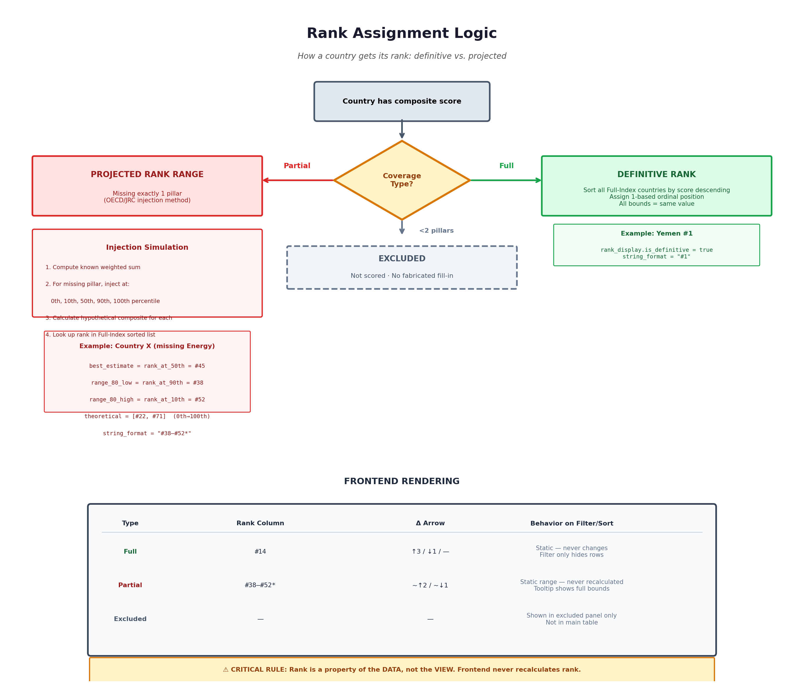

# CII Methodology

> **Naming note:** this system is named CII in every function name, REST
> slug, and shortcode (`cii_build_composite()`,
> `/wp-json/blomstra/v1/critical-infrastructure-index`, `[cii_index]`,
> etc.) — but the intended full name is **Critical Infrastructure
> Vulnerability Index (CIV)**. The rename is a deliberately deferred,
> tracked task (it touches function names, the REST slug, the shortcode,
> and localStorage keys) — not yet done as of this writing. This document
> uses "CII" throughout to match what's actually in the code, so grepping
> the codebase for anything mentioned here won't come up empty.

This is the part of the system least reconstructable from reading code
alone — the reasoning behind *why* it works this way, not just what the
code does. Grounded directly in `cii_build_composite()`, the real
function, not a paraphrase.



## The core problem this methodology solves

Every country doesn't have real data for every pillar. A naive composite
index has exactly two bad options when data is missing: drop the country
entirely (throwing away a partial, still-informative picture), or
silently fill the gap with some estimate and present the resulting rank
as if it were exactly as solid as everyone else's. CII does neither.
Instead it does three things, precisely:

1. **Never fabricate a value.** A missing pillar is never filled in with
   an estimate and then treated as real.
2. **Exclude only when there's too little to say anything.** A country
   with real data for at most 1 of 3 pillars is excluded outright — not
   scored, not ranked, with the reason recorded in `excluded_detail`.
3. **For everyone else, report uncertainty honestly rather than hiding
   it.** A country missing exactly one pillar still gets ranked — as a
   *range*, not a fabricated single number — following the OECD/JRC
   Handbook's guidance on reporting uncertainty rather than imputing it
   away.

## Pillars and weights

```php
CII_WEIGHT_ENERGY   = 0.3333
CII_WEIGHT_HHI       = 0.3333   // "Supplier Concentration" in the frontend
CII_WEIGHT_MARITIME = 0.3334
CII_MIN_PILLARS_REQUIRED = 2
```

Near-equal thirds (summing to exactly 1.0000). `CII_MIN_PILLARS_REQUIRED
= 2` is the exclusion threshold — and because there are exactly 3
pillars total, "at least 2 present" is mathematically the same condition
as "at most 1 missing." That equivalence is what makes the Partial Index
rank-range logic below work at all — it assumes exactly one missing
pillar, never two. **This is a structural assumption tied to having
exactly 3 pillars.** A future index built with 4+ pillars cannot reuse
this exact logic unmodified — it would need to generalize the
rank-range derivation to handle more than one simultaneously-missing
pillar, which is a real design decision, not a copy-paste.

## Step 1: Percentile-rank normalization

Each pillar's raw values (whatever unit they're actually in — HHI's
0–10,000 scale, Energy's dependency percentage, Maritime's LSCI score)
get converted to a 0–100 percentile rank via `cii_compute_percentile_ranks()`,
independently per pillar, before anything else happens. This is the same
method the World Bank uses for its Worldwide Governance Indicators (WGI),
following Nardo et al.'s OECD/JRC Handbook on constructing composite
indicators.

**Why percentile rank instead of min-max normalization or z-scores:**
raw units aren't comparable across pillars (HHI's 0–10,000 scale means
nothing next to a percentage), and percentile rank is far less sensitive
to extreme outliers than min-max scaling — one country with an
extreme raw value doesn't compress everyone else's range.

**Tie handling:** countries with (near-)identical raw values (within
`0.0001`) share the *average* rank across the tied group, not an
arbitrary tiebreak — e.g. three countries tied for 5th-7th place all get
rank `(5+6+7)/3 = 6`, converted to the same percentile. This is the
standard "mean rank" tie-handling method, not a CII-specific choice.

Formula, per country: `percentile = ((rank - 0.5) / n) * 100`, where `n`
is the count of countries with real data for that pillar (only —
excluded/missing countries don't affect anyone else's percentile for
that pillar).

## Step 2: Maritime inversion

Maritime's raw indicator (World Bank LSCI) measures *connectivity* — a
higher number is *better* infrastructure. Every other pillar is oriented
the opposite way: a higher percentile means *more vulnerable*. So Maritime's
connectivity percentile is inverted before use:

```php
maritime_vulnerability_percentile = 100 - maritime_connectivity_percentile
```

Both the pre- and post-inversion percentiles are kept in the output
(`maritime_connectivity_percentile` and `maritime_vulnerability_percentile`)
— only the vulnerability-oriented one feeds the composite score.

## Step 3: Composite score — weighted average of only the pillars present

```php
composite_score = (Σ present_pillar.value × present_pillar.weight) / (Σ present_pillar.weight)
```

Dividing by the sum of only the *present* pillars' weights means the
weights are implicitly renormalized to sum to 1 for whatever subset of
pillars a country actually has — a country missing Maritime effectively
splits its score 50/50 between Energy and HHI, not 33/33 with a silent
third of the score missing.

## Step 4: Coverage type and exclusion

- **0-1 real pillars** → excluded entirely. `excluded_detail[iso3]` records
  `pillars_present`, `pillars_missing`, and a human-readable reason. No
  score, no rank, not present in `countries` at all.
- **2 of 3 pillars** → `coverage_type: 'partial'`.
- **3 of 3 pillars** → `coverage_type: 'full'`.

## Step 5: Rank derivation — this is the part worth reading carefully

**Full Index countries** get a definitive rank: count how many *other*
Full-Index countries have a strictly higher composite score, add 1.
(Standard "competition ranking" — ties share a rank and the next rank
number is skipped, not compressed.) `rank_display` for a Full Index
country is trivial — every field (`best_estimate`, `range_80_low/high`,
`theoretical_low/high`) is just that same single rank number, and
`is_definitive: true`.

**Partial Index countries** never get a real `rank` value (`rank: null`
in the output) — instead they get a *projected range*, derived like this:

1. Take the two pillars the country *does* have, at their real
   percentile values and real weights — call this the "known weighted
   sum."
2. For the one missing pillar, don't guess once — inject **five**
   candidate percentile values in turn: `0, 10, 50, 90, 100`.
3. For each injected value, compute a hypothetical composite score
   (`known_weighted_sum + injected_value × missing_pillar_weight`), then
   find what rank *that* hypothetical score would occupy among the real
   Full-Index countries' actual scores.
4. This produces five hypothetical ranks, one per injected value.
   - `best_estimate` = the rank from injecting **50** (the global
     median guess for the missing pillar) — a single representative
     number, not a range, for contexts that need one number.
   - **80% Plausible Range** = the ranks from injecting **90** and **10**,
     sorted — simulating the missing pillar landing anywhere in the
     "typical" 10th–90th percentile band of global data.
   - **Theoretical Bound** = the ranks from injecting **100** and **0** —
     the absolute widest the rank could possibly be, if the missing
     pillar turned out to be the most extreme value in either direction.
5. `string_format` renders as `#<range_80_low>–#<range_80_high>*` — the
   asterisk is a deliberate visual flag that this is a projection, not a
   placement (the frontend widget surfaces the wider theoretical bound
   as a tooltip on hover, not in the main display, to avoid
   overwhelming the table with two ranges at once).

This entire technique — injecting representative values rather than one
guess, and reporting a range instead of a false-precision point estimate
— is the OECD/JRC Handbook's documented approach to handling missing
data in composite indicators without imputation. It's also *why* the
frontend engine's rank-delta feature (see `01-architecture.md` /
[`08-reference-data-functions.md`](./08-reference-data-functions.md)) computes deltas from
`best_estimate` rather than the raw `rank` field — every row has a
`best_estimate`, Full or Partial alike, so deltas work uniformly across
both.

## What's tracked per country, and why

Beyond the score and rank, each country's row carries provenance and
coverage fields — see [`03-api-contract.md`](./03-api-contract.md) for
the exact schema. Two things worth understanding *why*, not just *what*:

- **Provenance strings** (`hhi_source`/`maritime_source`) exist because
  a structural zero looks numerically identical to a "great score" but
  means something completely different — a landlocked country's zero
  maritime connectivity is a known fact, not an absence of data, and a
  reader needs to be able to tell those apart at a glance.
- **`is_landlocked`** is why Maritime's structural-zero countries are
  scored in the **Full** Index, not Partial — see
  [`08-reference-data-functions.md`](./08-reference-data-functions.md)
  for the landlocked list itself.

The response-level metadata fields (`methodology_url`,
`global_averages_informational_only`, `weights`, etc.) are documented in
full in [`03-api-contract.md`](./03-api-contract.md) — worth reading
there for the exact shape, since this document focuses on *why* the
methodology works the way it does rather than restating the schema.

## What to read next

- How this gets served and rendered → [`01-architecture.md`](./01-architecture.md)
- The functions this methodology consumes (pillar data, snapshot
  history) → [`08-reference-data-functions.md`](./08-reference-data-functions.md)
- The exact response schema → [`03-api-contract.md`](./03-api-contract.md)
