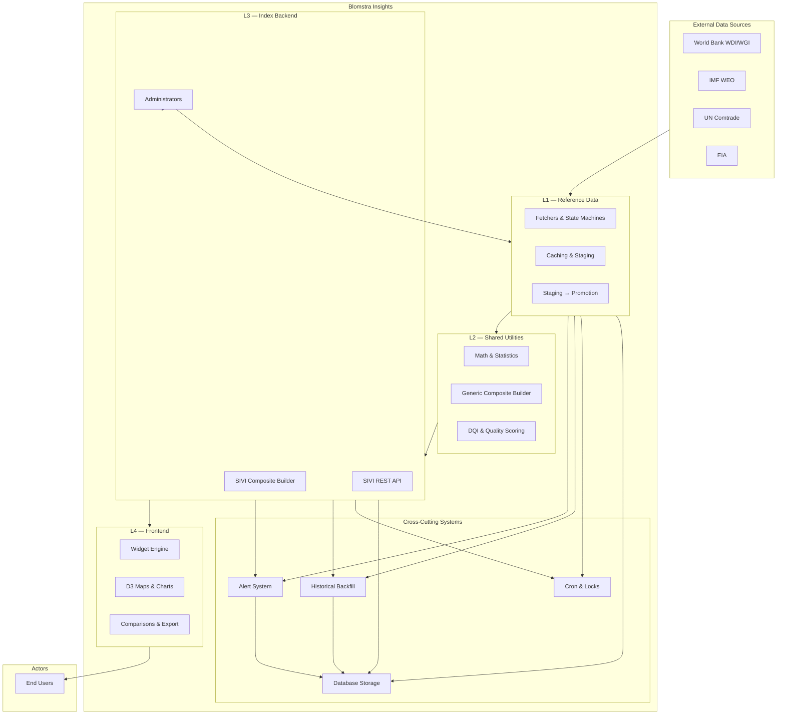
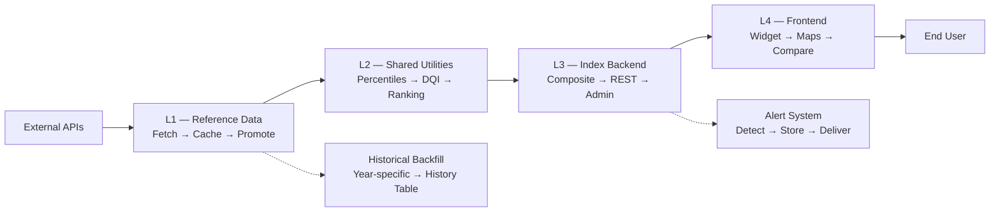
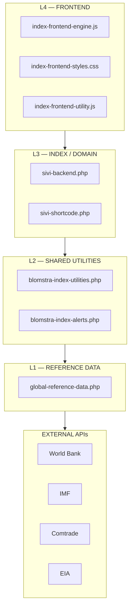

# **OVERVIEW\.md – Blomstra Insights System Overview** 

Document version: 1.0.0\
Status: CANONICAL\
Purpose: Entry point to the Blomstra Insights documentation system\
Last verified against commit: (to be filled)\
Effective date: 2026-09-09

***

## **Document Control** 

|                         |                                                                               |
| ----------------------- | ----------------------------------------------------------------------------- |
| Field                   | Value                                                                         |
| Document                | `OVERVIEW.md` v1.0.0                                                          |
| Verified against commit | (to be filled)                                                                |
| Purpose                 | Entry point, subsystem map, navigation hub, 10-minute understanding           |
| Audience                | New developers, AI agents, stakeholders, anyone needing a quick understanding |
| Reading time            | \~10-15 minutes                                                               |

***

## **1. What Is Blomstra Insights?** 

Blomstra Insights is a research and data platform that builds, stores, and serves country-level composite indices from public international data sources. It combines:

|                            |                                                                                                    |
| -------------------------- | -------------------------------------------------------------------------------------------------- |
| Component                  | Description                                                                                        |
| Reference data acquisition | Fetches data from public APIs (World Bank, IMF, UN Comtrade, EIA)                                  |
| Statistical computation    | Computes composite indices using percentile normalization, winsorization, and weighted aggregation |
| Index backend              | Serves index data via REST API with historical snapshots                                           |
| Reusable frontend          | Interactive widget engine for visualizing data with maps, charts, and comparisons                  |
| Operational infrastructure | Cron scheduling, alerts, health monitoring, and recovery                                           |

What it is NOT:

- A general-purpose analytics tool

- A replacement for the data sources it consumes

- A standalone database or data warehouse

- A commercial product (it's a research platform)

Current status: SIVI (Sovereign Infrastructure Vulnerability Index) is live. SERI and GPRI are future work.

***

## **2. The Big Picture** 

### **2.1 System Context Diagram** 

### **2.2 High-Level Data Flow** 
***

## **3. The Four-Layer Architecture** 

***

## **4. Subsystem Breakdown** 

### **4.1 L1 — Reference Data Layer** 

File: `src/shared/global-reference-data.php`

What it is: The sole point of contact with external data providers. No index-specific logic exists here — only "fetch indicator X" or "fetch HHI for year Y."

What it does:

- Fetches data from World Bank, IMF, UN Comtrade, and EIA

- Caches data in options and transients

- Uses state machines for long-running fetches (HHI, EIA)

- Implements staging→promotion to prevent data corruption

- Manages cron locks to prevent duplicate runs

Key components:

- State machines (HHI, EIA, WB Indicators)

- Staging→promotion with coverage thresholds (≥80%)

- Universe-aware promotion gates (per-source, not global)

- Partial-progress promotion on quota exhaustion

- Historical year-specific fetchers

Black-box view:

    text
    Input:  External API calls (World Bank, IMF, Comtrade, EIA)
    Process: Fetch → Cache → Validate → Promote
    Output: Structured data in wp_options and wp_transients

Details : [`DATA.md`](Data.md)

***

### **4.2 L2 — Shared Utilities** 

File: `src/shared/blomstra-index-utilities.php`

What it is: Pure PHP math and statistics, reusable across all indices. No WordPress dependencies (except the generic builder, which is L3-boundary).

What it does:

- Computes percentile ranks with tie handling

- Applies winsorization to control outliers

- Computes DQI (Data Quality Index)

- Calculates CAGR, standard deviation

- Computes Spearman correlation, Cronbach's α

- Generates bootstrap confidence intervals (weight sensitivity)

- Builds canonical flat snapshot rows

- Orchestrates the generic composite builder

Key components:

- Percentile computation (`blomstra_compute_percentile_ranks_safe`)

- Data Quality Index (`blomstra_compute_dqi`, `blomstra_compute_composite_dqi`)

- Partial-rank projection (`blomstra_project_partial_rank_composite`)

- Rank display helpers (`blomstra_build_full_rank_display`, `blomstra_build_partial_rank_display`)

- Generic composite builder (`blomstra_build_index_composite`)

- Provenance tracking (`blomstra_track_source`)

Black-box view:

    text
    Input:  Raw data arrays from L1
    Process: Winsorize → Percentile → Directional transform → Aggregate → Rank
    Output: Percentiles, composite scores, DQI, ranks, sensitivity intervals

Link: [`ARCHITECTURE.md §10`](Architecture.md)

***

### **4.3 L3 — Index Backend (SIVI)** 

Files: `src/indices/sivi/sivi-backend.php`, `sivi-shortcode.php`

What it is: The SIVI index implementation — pillar definitions, composite building, REST API, and admin UI.

What it does:

- Defines pillar weights and definitions (Energy, HHI, Maritime)

- Refreshes pillars from L1 caches

- Builds composite via generic builder (delegates statistics to L2)

- Reshapes generic output to SIVI's public schema

- Stores scenarios separately (never overwrites production)

- Manages historical backfill

- Exposes REST endpoint and admin UI

Key components:

- Pillar definitions (`sivi_get_pillar_weights`, `sivi_get_pillar_defs`)

- Composite builder (`sivi_build_composite` → generic builder)

- Scenario storage (`sivi_store_scenario`, `sivi_list_scenarios`)

- Historical backfill (`sivi_build_historical_snapshot`)

- REST endpoint (`/wp-json/blomstra/v1/sovereign-infrastructure-vulnerability-index`)

- Admin UI (`sivi_render_admin_page`)

Black-box view:

    text
    Input:  Pillar data from L1 caches
    Process: Percentiles → Composite → Ranking → DQI → Reshape
    Output: SIVI composite index via REST API + admin UI

Link: `SIVI.md`

***

### **4.4 L4 — Frontend Widget Engine** 

Files: `src/frontend/index-frontend-engine.js`, `index-frontend-styles.css`, `index-frontend-utility.js`

What it is: A self-contained, config-driven JavaScript widget engine that renders interactive data visualizations for any Blomstra index. One engine powers all indices.

What it does:

- Discovers widgets via `.biw[data-biw-slug]`

- Reads configuration from `data-biw-*` HTML attributes

- Fetches index data, country names, and historical snapshots via REST

- Renders interactive dashboards with tables, maps, charts, and comparisons

- Manages client-side state: filtering, sorting, watchlist, comparison list, dark mode

- Supports CSV export, sharing, and deep-linking via URL hash

Key components:

- Widget discovery and initialization

- Config-driven rendering (`data-biw-*` attributes)

- Dashboard view (map, charts, cards)

- Table view (sortable, filterable)

- Country drawer (details, radar, history, provenance)

- Country comparison (up to 4 countries)

- Group comparison (pre-defined groups)

- Watchlist (localStorage per slug)

- CSV export and sharing

- Dark mode

Black-box view:

    text
    Input:  HTML container with data-biw-* attributes + REST API responses
    Process: Discover → Configure → Fetch → Render → Interact
    Output: Rendered interactive UI (tables, maps, charts, comparisons)

Link: [`Frontend-Index.md`](Frontend-Index.md)

***

### **4.5 Alert System**

File: `src/shared/blomstra-index-alerts.php`

What it is: A cross-cutting subsystem that detects changes between composite builds and sends notifications via email, webhook, and Slack.

What it does:

- Compares new vs. old composite data after each successful build

- Detects rank changes, score changes, and pillar changes (≥0.01 threshold)

- Stores alerts in `wp_blomstra_alerts` table

- Queues notifications for background delivery (via cron)

- Sends email, webhook (JSON payload), and Slack messages

- Cleans up old alerts (retention + per-index max)

Key components:

- Change detection (`blomstra_alert_detect_changes`)

- Alert storage (`blomstra_alert_store_records`)

- Background delivery (`blomstra_deliver_pending_alerts`)

- Cooldown (5-minute dedup)

- Cleanup (`blomstra_alert_cleanup`)

Black-box view:

    text
    Input:  Old + new composite data
    Process: Detect changes → Store → Queue → Deliver
    Output: Email, webhook POST, Slack messages

Link: `OPERATIONS.md` §7, `ARCHITECTURE.md` §11

***

### **4.6 Historical Backfill** 

What it is: A subsystem that reconstructs point-in-time index data for past years, enabling trend analysis and historical comparison in the frontend.

What it does:

- Rebuilds composite scores for a specific past year using year-specific data fetchers

- Uses the same generic builder as live builds (ensures consistent methodology)

- Saves snapshots to `wp_blomstra_index_history` table with the correct period key

- Tracks backfill status per year (not\_started, scheduled, success, partial, failed)

- Runs backfill jobs in the background (one year per cron invocation)

Key components:

- Year-specific fetchers (`blomstra_fetch_eia_for_year`, `blomstra_fetch_hhi_for_year`, `blomstra_fetch_maritime_for_year`)

- Memoized fetchers (each called once per backfill run)

- Retry-only-missing logic (REF-BUG-3/6 fixes)

- Real source year tracking (REF-BUG-6 fix)

- Status tracking (`sivi_backfill_status` option)

- Backfill lock (`sivi_backfill_lock`)

Black-box view:

    text
    Input:  Target year
    Process: Fetch year-specific data → Build composite → Build snapshot row → Save
    Output: Historical snapshots in wp_blomstra_index_history table

Link: `SIVI.md` §10, `DATA.md` §8

***

### **4.7 Database Storage** 

What it is: The persistent storage layer for all Blomstra Insights data, including options, transients, and custom tables.

What it does:

- Stores composite data, pillar data, credentials, configuration, and state machine pointers in `wp_options`

- Caches API responses, cron locks, cooldowns, and flags in `wp_transients`

- Stores historical snapshots, alerts, historical data cache, and cache job status in custom tables

- Creates and migrates table schemas on `admin_init`

- Provides data persistence across requests and server restarts

Key components:

WordPress Core Tables:

- `wp_options` – Persistent key-value storage (composite data, pillar data, credentials, pointers)

- `wp_transients` – Expiring cache (API caches, cron locks, cooldowns)

Custom Tables:

- `wp_blomstra_index_history` – Historical snapshots (trend analysis, historical comparison)

- `wp_blomstra_alerts` – Alert records (change detection, notifications)

- `wp_blomstra_historical_data` – Historical data cache (year-specific fetchers)

- `wp_blomstra_cache_jobs` – Cache job status (backfill tracking)

Black-box view:

    text
    Input:  Write operations from L1, L2, L3 subsystems
    Process: Store in options/transients/tables with appropriate TTL
    Output: Persistent data accessible across requests

Link: `DATABASE.md`

***

### **4.8 Operations & Monitoring** 

What it is: The operational infrastructure that keeps the system running — cron scheduling, lock management, health monitoring, and recovery procedures.

What it does:

- Schedules and executes cron jobs for data acquisition and index rebuilding

- Manages locks to prevent duplicate cron runs

- Tracks health states for all pillars and subsystems

- Provides admin UI for monitoring and manual intervention

- Handles recovery scenarios (stuck locks, corrupt staging, API outages)

Key components:

Cron Schedule:

|           |                   |                           |
| --------- | ----------------- | ------------------------- |
| Day       | Job               | Notes                     |
| Monday    | Maritime refresh  | Simple, single-pass       |
| Tuesday   | EIA refresh       | Chunked, self-reschedules |
| Wednesday | HHI refresh       | Chunked, self-reschedules |
| Thursday  | WB Indicators     | Pointer-sequenced         |
| Friday    | IMF refresh       | Simple, single-pass       |
| Daily     | SIVI auto-refresh | 03:00 UTC                 |
| Daily     | Alert cleanup     | 1h after activation       |

Lock Management:

- All cron handlers use lock transients to prevent duplicate runs

- TTLs: 30 min (HHI/EIA/WB), 10 min (IMF/Maritime), 30 min (SIVI build)

- Stale locks auto-expire; shutdown function clears build locks on fatal error

Health States:

|           |      |                                |
| --------- | ---- | ------------------------------ |
| State     | Icon | Meaning                        |
| success   | 🟢   | Last run completed, data fresh |
| partial   | 🟡   | Some data missing              |
| running   | 🔵   | Currently executing            |
| stuck     | 🔴   | Lock exists but run timed out  |
| error     | 🔴   | Permanent failure              |
| retryable | 🟠   | Transient failure, will retry  |
| stale     | 🟡   | Exceeds freshness threshold    |
| never-run | ⚪    | No data, no pointer, no lock   |

Black-box view:

    text
    Input:  Time (cron triggers) + Admin actions
    Process: Schedule jobs → Acquire locks → Execute → Track health → Handle failures
    Output: Scheduled cron jobs, health status, recovery actions

Link: `OPERATIONS.md`

***

## **5. Document Navigation Map** 

|                             |                                              |                                                                |
| --------------------------- | -------------------------------------------- | -------------------------------------------------------------- |
| Document                    | When to Read                                 | What It Covers                                                 |
| `OVERVIEW.md`               | Start here                                   | System overview, subsystem map, navigation                     |
| `BLOMSTRA-SPECIFICATION.md` | You need the canonical, complete system spec | Everything at a detailed level (normative + descriptive)       |
| `ARCHITECTURE.md`           | You want to understand the system design     | Layers, invariants, component responsibilities, data flow      |
| `SIVI.md`                   | You're working on the SIVI index             | Pillar definitions, calculations, refresh, historical backfill |
| `FRONTEND.md`               | You're working on the widget                 | Config contract, views, state management, features             |
| `API.md`                    | You're integrating with the system           | REST endpoints, request/response shapes, error codes           |
| `DATA.md`                   | You're working on data acquisition           | L1 fetchers, state machines, staging/promotion, cron           |
| `OPERATIONS.md`             | You're deploying or monitoring               | Cron, locks, alerts, recovery, emergency procedures            |
| `DEVELOPMENT.md`            | You're contributing code                     | Engineering rules, PR process, new index guide                 |
| `DATABASE.md`               | You need to understand storage               | Schema, options, transients, custom tables, backup             |
| `AUDIT.md`                  | You need verification evidence               | Spec vs. code validation, audit results                        |

***

## **6. Key Architectural Decisions** 

|                                     |                                         |                                                                         |
| ----------------------------------- | --------------------------------------- | ----------------------------------------------------------------------- |
| Decision                            | Why                                     | Implication                                                             |
| Four-layer architecture             | Separation of concerns                  | No cross-layer dependencies; each layer has a single responsibility     |
| State machines for fetchers         | Resilience to timeouts and failures     | Progress is never lost; resumable across cron ticks                     |
| Staging → atomic promotion          | Data integrity                          | Bad data never corrupts production; old data preserved on failure       |
| Universe-aware promotion gates      | Correctness for narrow-coverage sources | EIA fuels with 30 countries promote correctly (REF-BUG-2)               |
| Partial-progress promotion on quota | Efficiency                              | Already-fetched data isn't discarded on quota exhaustion (REF-BUG-1)    |
| Config-driven frontend              | Reusability                             | One engine for all indices; no hardcoded field names (Invariant #5)     |
| Generic index builder               | Consistency                             | All indices share the same math; no per-index statistics (Invariant #3) |
| Canonical snapshot row builder      | Consistency                             | Live and historical rows always match shape (Invariant #2)              |
| Bookkeeping key isolation           | Safety                                  | Builder's internal key ≠ public option key (Invariant #1)               |
| Auto-rollback on build failure      | Production safety                       | Bad builds don't wipe live index; old data preserved                    |
| Background alert delivery           | Performance                             | Builds not delayed by email/webhook/Slack API calls                     |
| Debounced SIVI refresh              | Efficiency                              | Source refreshes trigger SIVI rebuild without waiting for daily cron    |

***

## **7. Getting Started** 

### **7.1 By Role** 

|                     |                                                                             |
| ------------------- | --------------------------------------------------------------------------- |
| Role                | Recommended Reading Order                                                   |
| Developer (new)     | `OVERVIEW.md` → `ARCHITECTURE.md` → `DEVELOPMENT.md` → Pick a subsystem doc |
| Data Scientist      | `OVERVIEW.md` → `SIVI.md` → `DATA.md` → `API.md`                            |
| DevOps              | `OVERVIEW.md` → `OPERATIONS.md` → `DATABASE.md` → `API.md`                  |
| Product/Stakeholder | `OVERVIEW.md` → `BLOMSTRA-SPECIFICATION.md` (executive summary sections)    |
| Frontend Developer  | `OVERVIEW.md` → `FRONTEND.md` → `API.md`                                    |
| Backend Developer   | `OVERVIEW.md` → `ARCHITECTURE.md` → `DATA.md` → `SIVI.md`                   |

### **7.2 By Task** 

|                            |                                                            |
| -------------------------- | ---------------------------------------------------------- |
| Task                       | Relevant Documents                                         |
| Add a new index            | `DEVELOPMENT.md` §12 + `SIVI.md` (as template) + `DATA.md` |
| Debug a data fetch failure | `OPERATIONS.md` §9 + `DATA.md`                             |
| Deploy the system          | `OPERATIONS.md` §2 + §9                                    |
| Fix a frontend issue       | `FRONTEND.md` + `API.md`                                   |
| Understand the database    | `DATABASE.md`                                              |
| Integrate with the API     | `API.md`                                                   |
| Add a new data source      | `DATA.md` + `DEVELOPMENT.md`                               |

***

## **8. Glossary (High-Level)** 

|                        |                                                                                                |
| ---------------------- | ---------------------------------------------------------------------------------------------- |
| Term                   | Definition                                                                                     |
| SIVI                   | Sovereign Infrastructure Vulnerability Index — the current live index                          |
| SERI                   | Sovereign Economic Resilience Index — future work                                              |
| GPRI                   | Geopolitical Risk Index — future work                                                          |
| BMS                    | Blomstra Methodology Standard — the architectural standard all indices must follow             |
| Pillar                 | A thematic dimension of an index (e.g., Energy, HHI, Maritime)                                 |
| Composite              | The final index score, computed as a weighted average of pillar scores                         |
| DQI                    | Data Quality Index — freshness metric; disclosure-only (does not affect score)                 |
| State machine          | A resumable pointer pattern for long-running fetchers (HHI, EIA, WB)                           |
| Staging → promotion    | Two-phase write: data written to staging, validated, then atomically promoted to production    |
| Universe-aware gate    | Promotion threshold judged against a source's own fetchable universe, not global country count |
| Auto-rollback          | If a new build has <80% of previous country count, old data is preserved                       |
| Config-driven frontend | All behavior controlled by `data-biw-*` attributes — no hardcoded field names                  |
| Historical backfill    | Reconstructing point-in-time index data for past years                                         |
| Background delivery    | Alerts sent via cron, not inline during builds                                                 |

***

## **9. Document Status** 

|                             |           |
| --------------------------- | --------- |
| Document                    | Status    |
| `OVERVIEW.md`               | CANONICAL |
| `BLOMSTRA-SPECIFICATION.md` | CANONICAL |
| `AUDIT.md`                  | CANONICAL |
| `ARCHITECTURE.md`           | CANONICAL |
| `SIVI.md`                   | CANONICAL |
| `FRONTEND.md`               | CANONICAL |
| `API.md`                    | CANONICAL |
| `DATA.md`                   | CANONICAL |
| `OPERATIONS.md`             | CANONICAL |
| `DEVELOPMENT.md`            | CANONICAL |
| `DATABASE.md`               | CANONICAL |

***

## **End of Overview** 

Status: CANONICAL
